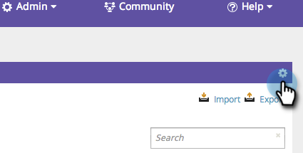
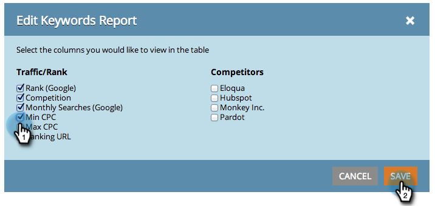
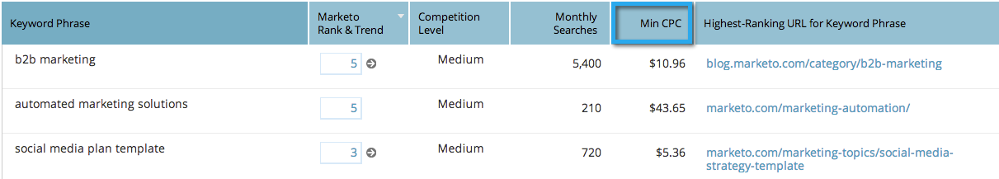

# SEO - Add/Remove Columns From Your Keywords View {#seo-add-remove-columns-from-your-keywords-view}

You can adjust your keyword view to display the data you are most interested in.

1. Go to the **Keywords** section.

   

   These are the default columns:

   

1. Click the gear icon.

   

1. Select or unselect the columns you'd like to see. Click **Save**.

   

   Awesome! You have now customized your keyword view.

   

   >[!MORELIKETHIS]
   >
   >[Understanding Keywords - Summary View](/help/marketo/product-docs/additional-apps/seo/keywords/seo-understanding-keywords.md)
