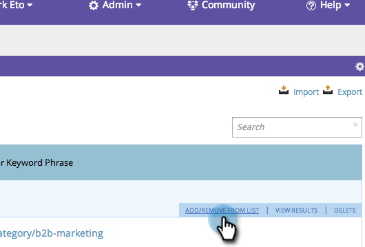
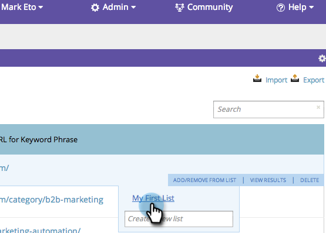
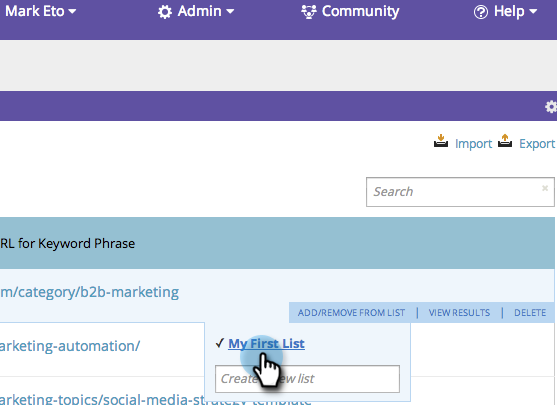

# SEO - Add/Remove Keywords from a List {#seo-add-remove-keywords-from-a-list}

You can keep all your keywords nice and organized by using lists. This will make finding data on specific keywords easy as pie.

## Add to a List {#add-to-a-list}

1. Go to the **Keywords** section.

   

1. Hover over the keyword you want to add to a list. Click **Add/Remove from list**.

   

1. Click the list and the keywords will be added.

   

   >[!TIP]
   >
   >You can also make a new list for your keywords. Just type the name in Create a new list.

   

Woo hoo! Select your list to see the new keywords.

## Remove Keyword from List {#remove-keyword-from-list}

You can also remove keywords from a list.

1. Go to the **Keywords** section.

   

1. Hover over the keyword you want to remove from a list. Click **Add/Remove from list**.

   

1. Click the list that you want to remove the keywords from.

   >[!NOTE]
   >
   >All lists that the keyword belongs to currently will have a check mark. Once removed from the list, the check disappears.

   

   Perfect, the keyword is no longer on this list. Refresh your page to update the display.

   >[!MORELIKETHIS]
   >
   >[Understanding Keywords (Summary View)](/help/marketo/product-docs/additional-apps/seo/keywords/seo-understanding-keywords.md)
