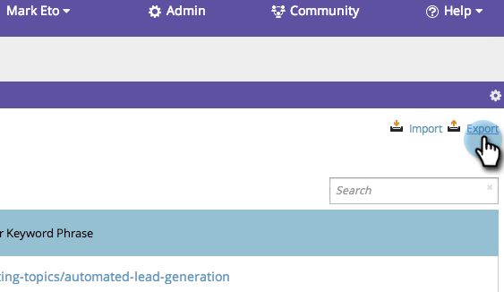

# SEO - Exporting Keyword Results {#seo-exporting-keyword-results}

You can export your keyword results to share with your team or to create a report.

1. Go to the **[!UICONTROL Keywords]** section.

   

1. Click **[!UICONTROL Export]**.

   

   Yep, it really is that easy.
