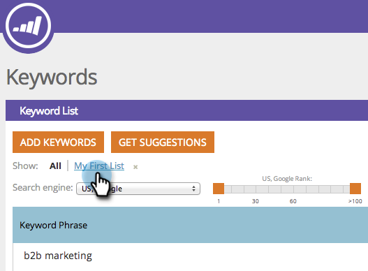

# SEO - Filter Keyword Results {#seo-filter-keyword-results}

You might have a lot of [keywords](seo-understanding-keywords.md). Here are different ways to filter them:

### What's in this article? {#whats-in-this-article}

[Filter by list](#filter-by-list)  
[Filter by SERP Rank](#filter-by-serp-rank)  
[Filter by Search](#filter-by-search)

#### Filter by list {#filter-by-list}

1. Go to the **Keywords** section.

   

1. Click the name of the list you are focused on.

   

   >[!NOTE]
   >
   >If you don't see any lists,&nbsp; [l](../../../../product-docs/additional-apps/seo/understanding-seo/seo-managing-lists.md) [earn how to make a keyword list](../../../../product-docs/additional-apps/seo/understanding-seo/seo-managing-lists.md).

Sweet! You will now only be looking at keywords on that list. 

#### Filter by SERP Rank {#filter-by-serp-rank}

1. Go to the Keywords section.

   

   The orange squares define your upper (left) and lower (right) limits. The filter works on the keyword's [SERP rank](../../../../product-docs/additional-apps/seo/understanding-seo/understanding-search-engine-optimization.md).

1. Slide the orange squares left/right to filter the results.

   

   #### Filter by Search {#filter-by-search}

   You can also find the keywords you are looking for using the search field in the upper right hand corner. 

1. Go to the **Keywords** section.

   

1. Enter your keyword into the search field.

   

   Congratulations! You are now a keyword filtering samurai warrior!

