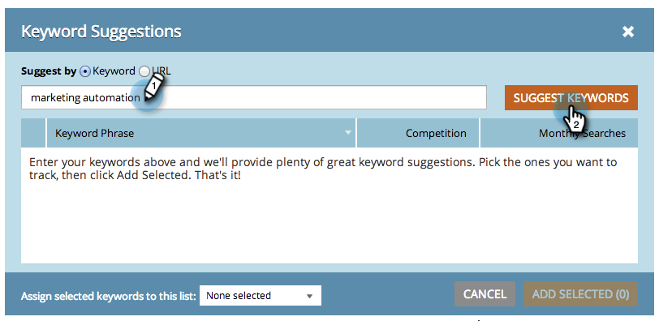
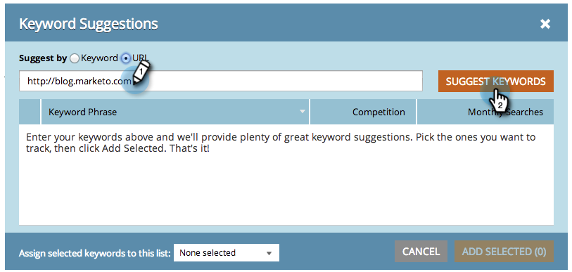
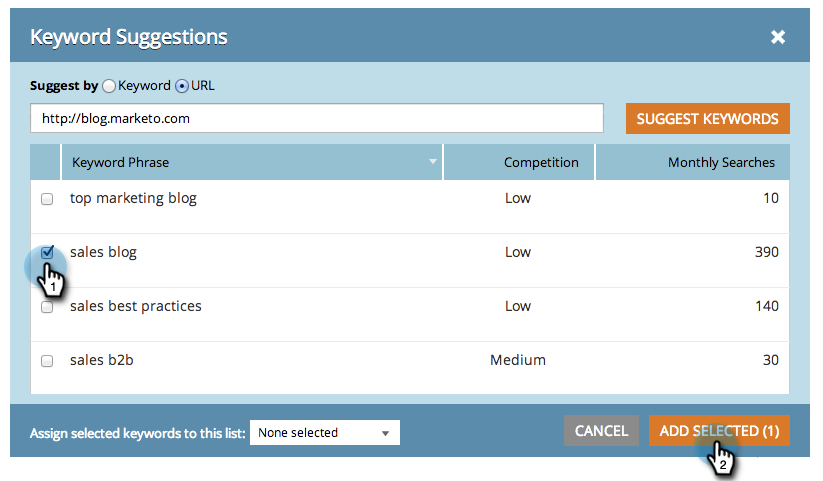

# SEO - Get Suggested Keywords {#seo-get-suggested-keywords}

Marketo SEO can suggest which keywords you should be tracking. We can give suggestions based on a keyword or a site's URL. Give it a go!

###

#### Get Keyword Suggestions Using a Keyword {#get-keyword-suggestions-using-a-keyword}

1. Go to the **Keywords**&nbsp;section.

   

1. Click **GET SUGGESTIONS**.

   

1. Enter a **Keyword**. Click **SUGGEST KEYWORDS**. 

   

   >[!TIP]
   >
   >Did you know you can&nbsp; [add your keyword to a new or existing list](../../../../product-docs/additional-apps/seo/understanding-seo/seo-managing-lists.md)&nbsp;right here?

1. Select suggested keyword(s). Click **ADD SELECTED**.

   

   Great! Your keyword has been added.

   

   Yeeeeehaw! Now that you know how to get keyword suggestions based on a keyword, try getting suggestions based on a URL.

## Get Keyword Suggestions From a URL  {#get-keyword-suggestions-from-a-url}

1. Go to the **Keywords** section.

   

1. Click **GET SUGGESTIONS**.

   

1. Set **Suggest by**&nbsp;to **URL**.

   

1. Enter a **URL** and click **SUGGEST KEYWORDS**. 

   

   >[!TIP]
   >
   >Did you know you can [add your keyword to a new or existing list](../../../../product-docs/additional-apps/seo/understanding-seo/seo-managing-lists.md) right here?

1. Select suggested keyword(s). Click **ADD SELECTED**.

   

1. Great! Your keyword has been added.

   

   OK, you are rockin' this thing. Carry on!

   >[!NOTE]
   >
   >**Related Articles**
   >
   >    
   >    
   >    * [Understanding Keywords (Summary View)](seo-understanding-keywords.md)
   >    * [Add/Remove Keywords from a List](seo-add-remove-keywords-from-a-list.md)
   >    
   >

