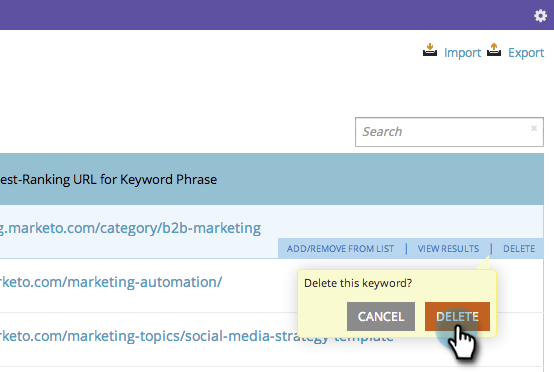

# SEO - Remove a Keyword {#seo-remove-a-keyword}

If you have a keyword that you don't want to continue optimizing for, here's how to remove it.

>[!IMPORTANT]
>
>On March 31, 2026, Marketo Engage will deprecate the Search Engine Optimization feature. Please export any relevant data on or before March 30. [Learn more](https://nation.marketo.com/t5/product-blogs/marketo-engage-seo-feature-deprecation/ba-p/359060){target="_blank"}.
>
>* [Export Issues](https://experienceleague.adobe.com/en/docs/marketo/using/product-docs/additional-apps/seo/pages/seo-export-issues-to-csv){target="_blank"}
>* [Export Keyword Results](https://experienceleague.adobe.com/en/docs/marketo/using/product-docs/additional-apps/seo/keywords/seo-exporting-keyword-results){target="_blank"}
>* [Export Keyword Trends](https://experienceleague.adobe.com/en/docs/marketo/using/product-docs/additional-apps/seo/reports/seo-use-the-keyword-trends-report#exporting-data){target="_blank"}
>* [Export Competitor Keyword Trends](https://experienceleague.adobe.com/en/docs/marketo/using/product-docs/additional-apps/seo/reports/seo-use-the-competitor-kw-trends-report#exporting-data){target="_blank"}

1. Click to go to the **[!UICONTROL Keywords]** section.

   

1. Hover over the keyword you'd like to remove and click **[!UICONTROL Delete]**.

   

1. Click **[!UICONTROL Delete]** again to confirm.

   
