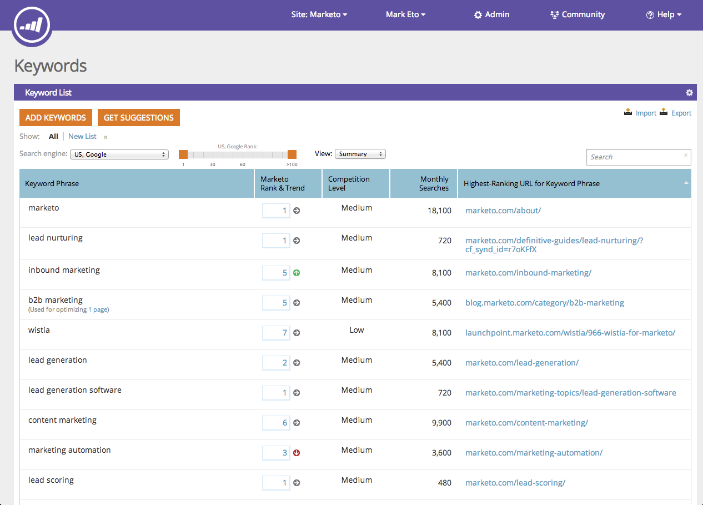
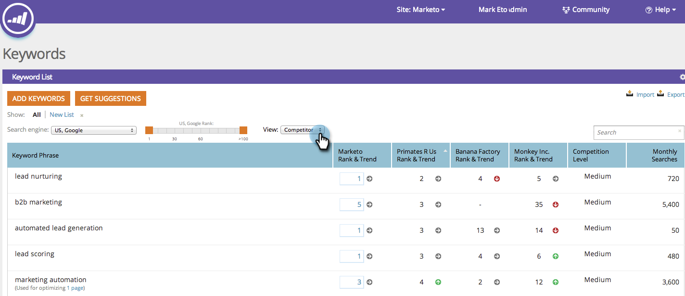

# SEO - Understanding Keywords {#seo-understanding-keywords}

[!UICONTROL Keywords] are the backbone of your SEO strategy. Your goal is to be on the first page, as close to #1 as possible for keywords relevant to your business.

The [!UICONTROL keywords] section will show you how successful your site is at achieving this and how you stack up to [your competition](/help/marketo/product-docs/additional-apps/seo/understanding-seo/seo-add-competitors.md).

## Keywords - Summary View {#keywords-summary-view}

 

<table> 
 <thead> 
  <tr> 
   <th colspan="1" rowspan="1">Column Name</th> 
   <th colspan="1" rowspan="1">Description</th> 
  </tr> 
 </thead> 
 <tbody> 
  <tr> 
   <td colspan="1" rowspan="1">Keyword Phrase</td> 
   <td colspan="1" rowspan="1">The keyword at hand.</td> 
  </tr> 
  <tr> 
   <td colspan="1" rowspan="1">Rank &amp; Trend</td> 
   <td colspan="1" rowspan="1">
The rank of your site for this keyword. Arrows show how your keyword rank is trending from the previous week 

  = rank up

 = rank down

 = rank the same
</td> 
  </tr> 
  <tr> 
   <td colspan="1" rowspan="1">Competition Level</td> 
   <td colspan="1" rowspan="1">The difficulty of getting ranked for a specific keyword. </td> 
  </tr> 
  <tr> 
   <td colspan="1" rowspan="1">Monthly Searches</td> 
   <td colspan="1" rowspan="1">How many searches happen per month on the keyword. This data is based on exact matches and is available only for Google-US over a 12-month period. </td> 
  </tr> 
  <tr> 
   <td colspan="1" rowspan="1">Highest Ranking URL for Keyword Phrase</td> 
   <td colspan="1" rowspan="1">Of your URLs, which is the highest ranking one for the keyword.</td> 
  </tr> 
 </tbody> 
</table>

## Keywords - Competitor View {#keywords-competitor-view}

You can also view how your competitors are performing using the same metrics by clicking on the view drop-down and selecting competitors.

Great! Now that you understand the [!UICONTROL keywords] section, let's learn about pages and inbound links.

>[!MORELIKETHIS]
>
>* [Understanding Pages](/help/marketo/product-docs/additional-apps/seo/pages/seo-understanding-pages.md)
>* [Understanding Inbound Links](/help/marketo/product-docs/additional-apps/seo/inbound-links/seo-understanding-inbound-links.md)
