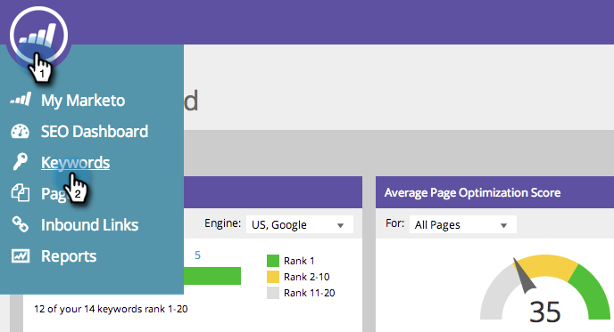
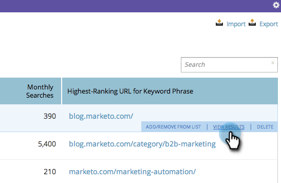
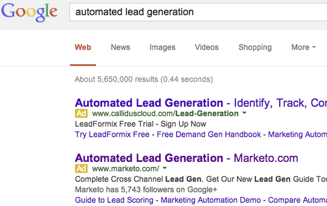

# SEO - View Keyword Results in a Search Engine {#seo-view-keyword-results-in-search-engine}

If you want to see how your content looks inside a search engine, we've added a handy little short cut.

1. Go to the **[!UICONTROL Keywords]** section.

   

1. Hover over a keyword. Click **[!UICONTROL View Results]**.

   

1. Choose which search engine you'd like to view your results in.

   

You should now see the search results for your keyword in a new window.

   
