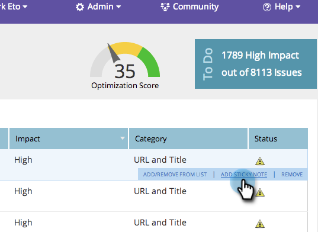
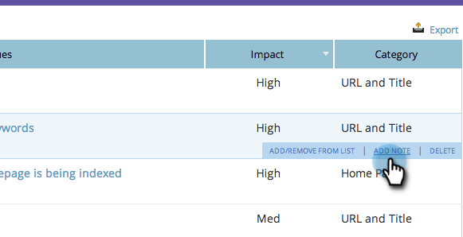
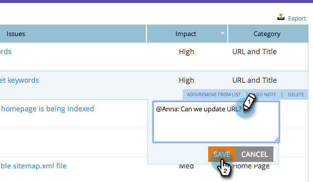

# SEO - Add Notes to Page Issues {#seo-add-notes-to-page-issues}

Did you know you can add notes to page issues as personal reminders or team messages?

## Adding Notes in Page Issues Section {#adding-notes-in-page-issues-section}

1. Go to the **[!UICONTROL Pages]** section.

   

1. On the pages tab, click **[!UICONTROL Issues]**.

   

1. Hover over the issue you'd like to add a note to. Click **[!UICONTROL Add Sticky Note]**.

   

1. Enter a note in the yellow text box. Clicking outside of the text box will save the note.

>[!TIP]
>
>You can delete your note by clicking the small **x** in the upper left hand corner.

## Add Notes in Page Detail Drill Down {#add-notes-in-page-detail-drill-down}

1. Go to the **[!UICONTROL Pages]** section.

   

1. Click on the page you wish to see details for.

   

1. Hover over the page issue you'd like to add a note to and click **[!UICONTROL Add Note]**.

   

1. Enter your note. Click **[!UICONTROL Save]**.

   

   Your note has been added!

   
