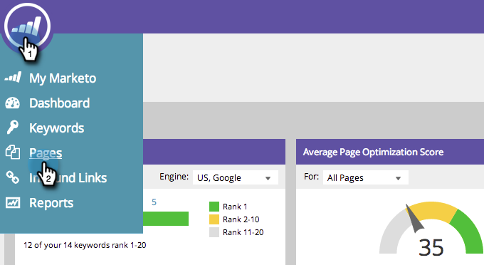
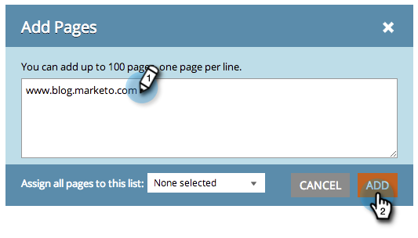

# SEO - Add Pages {#seo-add-pages}

You've got pages! Marketo SEO will automatically crawl your site and tracking them. In case we missed a few, get them in the SEO app like this:

1. Go to the **Pages** section.

   

1. Click **Add Pages**.

   

1. Type in the URLs you'd like to add. Click **Add**.

   

   >[!TIP]
   >
   >Did you know you can [add your page to a new or existing list](/help/marketo/product-docs/additional-apps/seo/understanding-seo/seo-managing-lists.md)? Check it out!

   It may take a moment for your page data to load. Wait for the green alert message and refresh your page to update the display.

   

   You can now track how this page is performing in search.
