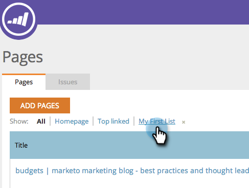

# SEO - Add/Remove Page from List {#seo-add-remove-page-from-list}

You want to manage your pages? You can easily do that by creating a list. You can use lists to organize pages or filter data in dashboards.

###

#### Add Page to a List {#add-page-to-a-list}

1. Go to the **Pages** section.

   

1. Hover over the page you want to add to a list. Click **ADD/REMOVE FROM LIST**.

   

1. Click on the list you'd like to add your page to.

   

   >[!TIP]
   >
   >You can also make a new list for your page to go. Just type your desired name in Create a new list. 

1. Click on the list you've just added your page to.

   

1. Yay! You should now see your page added to the list.

## Remove Page from a List {#remove-page-from-a-list}

1. Go to the Pages section.

   

1. On the pages tab, click the list you'd like to clean up.

   

1. Hover over the page you'd like to remove. Click **ADD/REMOVE FROM LIST**.

   

1. Click the list that you want to remove it from.

   >[!NOTE]
   >
   >All lists that the keyword belongs to currently will have a check mark. Once removed from the list, the check disappears.

   

1. Boom. Done. You page is removed from the list.

