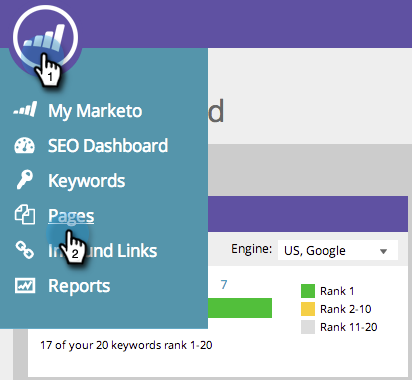

# SEO - Add/Remove Page Issue From a List {#seo-add-remove-page-issue-from-a-list}

You can organize your page issues into lists. You can also remove page issues from a list.

### What's in this article? {#whats-in-this-article}

[Add Page Issues to a List](#add-page-issues-to-a-list)  
[Remove Page Issue From a List](#remove-page-issue-from-a-list)

#### Add Page Issues to a List {#add-page-issues-to-a-list}

1. Go to the **Pages** section.

   

1. On the pages tab, click **Issues**. 
1. 

1. Hover over the page issue you want to add. Click **ADD/REMOVE FROM LIST**.

   

   ##### Click on the list you'd like to add your page issue to.  {#click-on-the-list-youd-like-to-add-your-page-issue-to}

   

   >[!TIP]
   >
   >You can also make a new list&nbsp;for your keyword to go. Just type your desired name in&nbsp;Create a new list.&nbsp;

   #### Remove Page Issue From a List {#remove-page-issue-from-a-list}

   ##### Go to the Pages section.  {#go-to-the-pages-section}

   

1. On the pages tab, click **Issues**. 
1. 

1. Click the list you'd like to organize.

   

1. Hover over the page issue you want to remove. Click **ADD/REMOVE FROM LIST**.

   

1. The list you'd like to organize should be checked. Click the list name to remove the page issue from this list.

   

   Excellent! Refresh your page and you will no longer see it on the list.

