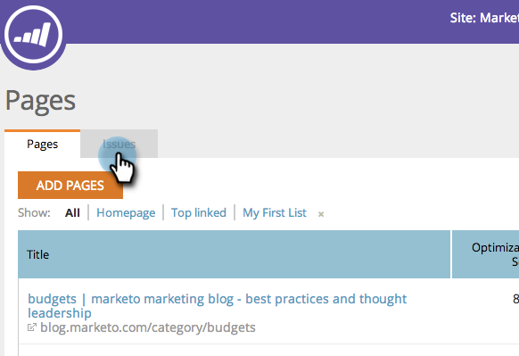
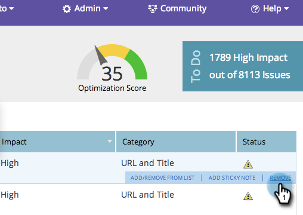
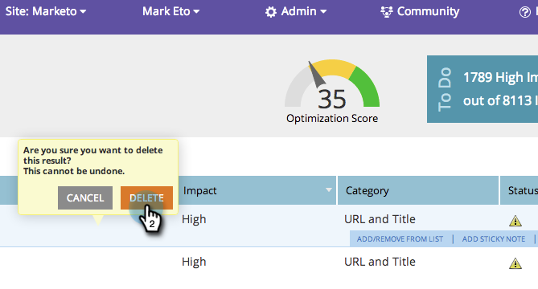

# SEO - Remove/Delete a Page Issue {#seo-remove-delete-a-page-issue}

Not all page issues might be useful to you. Here's how to remove one.

1. Go to the **[!UICONTROL Pages]** section.

   

1. In the [!UICONTROL Pages] section, click **[!UICONTROL Issues]**.

   

1. Hover over the page issue you want to remove. Click **[!UICONTROL Remove]**.

   

1. Clicking **[!UICONTROL Delete]** will permanently remove this page issue.

   >[!CAUTION]
   >
   >You can not undo this action. Once an issue is removed, you can rebuild the issues by removing the page and adding it back in.

   

Your page issue is now removed.
