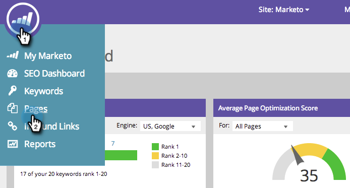
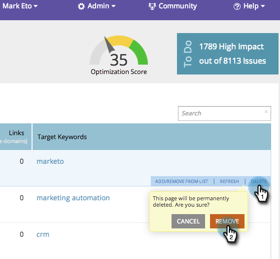

# SEO - Remove/Delete a Page {#seo-remove-delete-a-page}

Want to delete a page? No sweat, here's how.

1. Go to the **Pages** section.

   

1. On the pages tab, hover over the page you'd like to remove, click **Delete**, then click **Remove**.

   

Piece of cake. This page is now permanently removed from your list.
