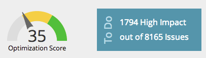
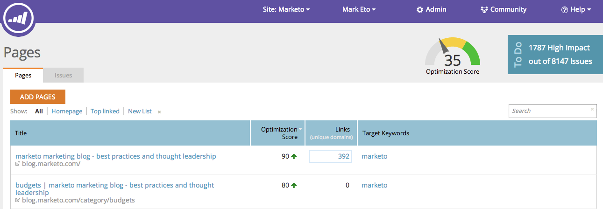
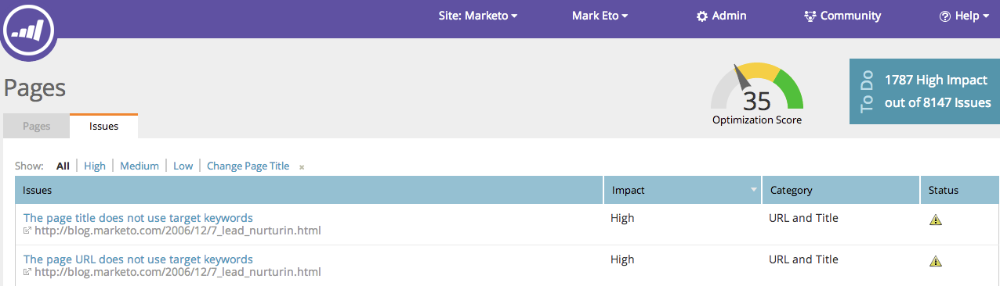

# SEO - Understanding Pages {#seo-understanding-pages}

## Page Optimization Score / To Do Widget {#page-optimization-score-to-do-widget}

The Page [!UICONTROL Optimization Score] is an overall ranking of how well your page is optimized for search, on a scale of 1 to 100. It is based on dozens of best practices in SEO.

* 0 - 35 = Not well-optimized
* 35 - 70 = On the right track
* 70 - 100 = Doing great!

>[!TIP]
>
>Click on the [!UICONTROL High Impact] link in the [!UICONTROL To Do] box, this will redirect you to the [!UICONTROL Issues tab] and show you high priority problems to solve.

## [!UICONTROL Pages] Tab {#pages-tab}

The **[!UICONTROL Pages] tab** shows you how well individual pages on your site are optimized for search.

 

| Column Name |Description |
|---|---|
| [!UICONTROL Title] |Title and URL of all pages on your domain. Verify your domain. |
| [!UICONTROL Optimization Score] |The secret sauce used to show you how well your page is optimized for search on a scale of 1 to 100. |
| [!UICONTROL Links] |Number of different domains with at least 1 inbound link to your site. |
| [!UICONTROL Target Keywords] |The keywords you decide to optimize each page for. [This requires your input](/help/marketo/product-docs/additional-apps/seo/pages/seo-using-the-page-detail-drill-down.md). |

## [!UICONTROL Issues] Tab {#issues-tab}

The **[!UICONTROL Issues] tab** will identify what improvements you can make to increase your optimization score and ranking.

| Column Name |Description |
|---|---|
| [!UICONTROL Issues] |List of actionable items that will help improve your Optimization Score. |
| [!UICONTROL Impact] |How critical it is to your overall score. Fix the high impact items first! |
| [!UICONTROL Category] |The type of issue being reported. |
| [!UICONTROL Status] |Is the task complete or still open. Once you and your webmaster fix the issue on your site, the status should change to resolved (green check). |

Awesome, now that you know the basics of pages, check out the [Page Detail Drill Down article](/help/marketo/product-docs/additional-apps/seo/pages/seo-using-the-page-detail-drill-down.md) to learn more cool things you can do.
