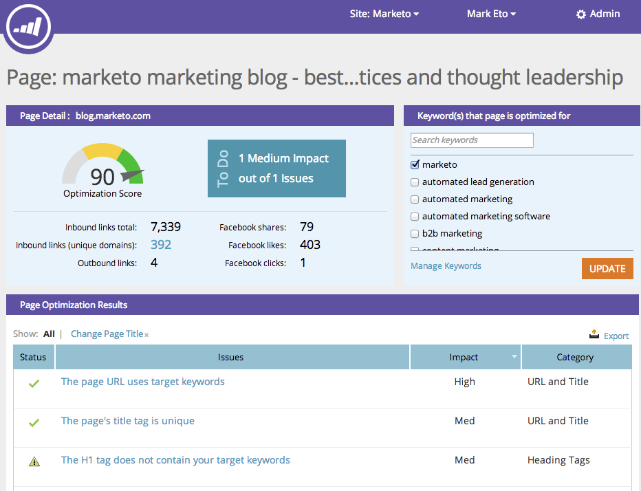
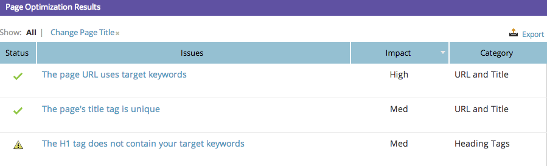

# SEO - Using the Page Detail Drill Down {#seo-using-the-page-detail-drill-down}

You can see a lot of information about your pages using the page detail drill down.

## Find Page Drill Down {#find-page-drill-down}

1. Go to the **[!UICONTROL Pages] section**.

   

1. Click on the page you wish to see details for.

   

   Behold, the Page Detail Drill Down!

   

## [!UICONTROL Page Detail] Section {#page-detail-section}

   

   | Item |Description |
   |---|---|
   | [!UICONTROL Optimization Score] |The secret sauce used to show you how well your page is optimized for search on a scale of 1 to 100. |
   | [!UICONTROL To Do] box |Displays number of open issues regarding the page you are on. |
   | [!UICONTROL Inbound Links Total] |The total number of inbound links to your website. |
   | [!UICONTROL Inbound Links (unique domains)] |The number of other websites with at least one inbound link to your site. |
   | [!UICONTROL Outbound Links] |The number of links going out to other websites from this particular page. |
   | [!UICONTROL Facebook Shares] |Number of times this page was shared on [!DNL Facebook]. |
   | [!UICONTROL Facebook Likes] |Number of times this page share was liked on [!DNL Facebook]. |
   | [!UICONTROL Facebook Clicks] |Number of clicks from the [!DNL Facebook share]. |

## [!UICONTROL Keyword(s) that Page is Optimized For]  {#keyword-s-that-page-is-optimized-for}

   This is where you [select which keyword you are trying to optimize your page for](/help/marketo/product-docs/additional-apps/seo/keywords/seo-optimize-specific-pages-with-targeted-keywords.md).

   >[!NOTE]
   >
   >This is an important step in getting the most out of this feature. We recommend that you use less than three keywords per page. Ideally just one.

   

## [!UICONTROL Page Optimization Results] {#page-optimization-results}

   The [!UICONTROL Page Optimization Results] will tell you the exact steps you need to take in order to increase your optimization score/perform better on search for this page.

   

   Pretty sweet, right? Learn more about Pages over here.

>[!MORELIKETHIS]
>
>[Optimize Specific Pages with Targeted Keywords](/help/marketo/product-docs/additional-apps/seo/keywords/seo-optimize-specific-pages-with-targeted-keywords.md)
