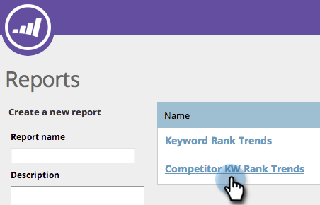
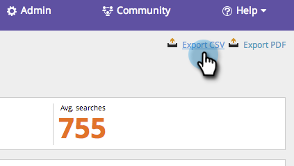

# SEO - Use the Competitor KW Trends Report {#seo-use-the-competitor-kw-trends-report}

SEO - Use the Competitor KW Trends Report - Marketo Docs - Product Documentation

In this report, you can see how you and your competitors are ranked on keywords over time.

#### Find Reports {#find-reports}

1. Go to **Reports**.

   

1. Click **Competitive KW Rank Trends**.

   

   ### What's in this article? {#whats-in-this-article}

   [Find Reports](#find-reports)  
   [KW Rank Trends Graph](#kw-rank-trends-graph)  
   [Filtering Data](#filtering-data)  
   [Exporting Data](#exporting-data)

#### KW Rank Trends Graph {#kw-rank-trends-graph}

This graph can show you what percentage of your keywords are ranked in a specified range and how your competitors stack up.

| Item |Description |
|---|---|
| Keywords  |The number of keywords you are tracking. |
| Ranking URLs  |The number of URLs on your site ranking in the range you've set.  |
| % in rank  |The percentage of keywords ranking in the range you've set.  |
| Avg. searches  |The average number of searches on those keywords that occurred during the range you set (in the last 30 days, on Google US search) |

#### Filtering Data {#filtering-data}

1. Click the drop-down and select your desired time period. 

   

1. Click the **Rank** drop-down to chose which rank range you want to view keywords for.

   

   #### Exporting Data  {#exporting-data}

   >[!TIP]
   >
   >You can export this report to your desktop.

1. Click **Export CSV** or **Export PDF**.

   

   A+ work!

