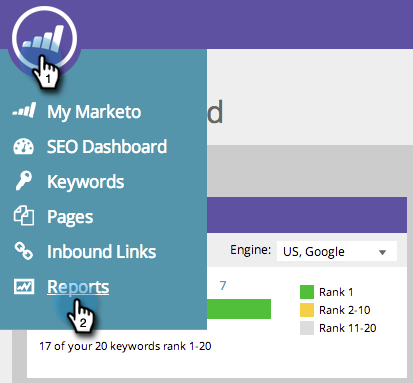
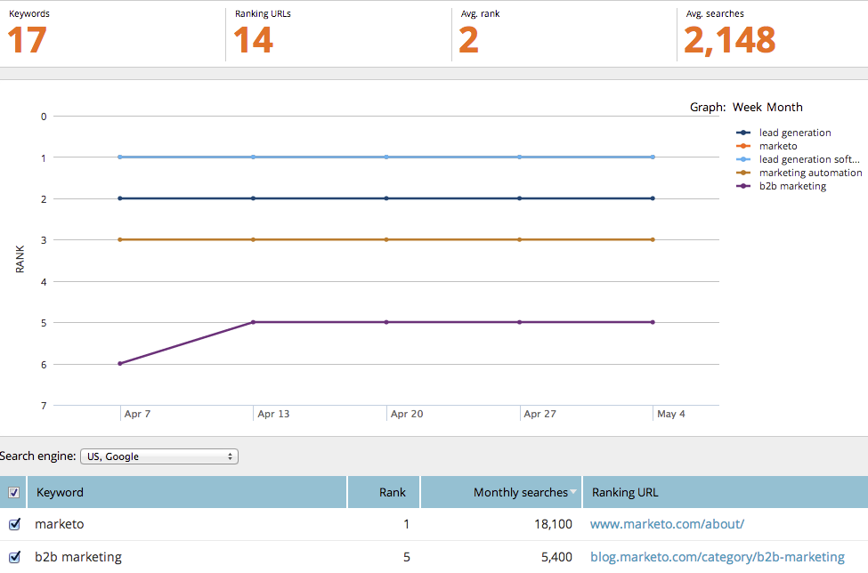
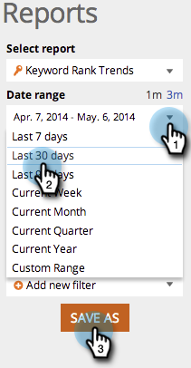

# SEO - Use the Keyword Trends Report {#seo-use-the-keyword-trends-report}

In this report, you can see how you are ranked on keywords over time.

## Load Report {#load-report}

1. Go to **Reports**.

   

1. Click on **Keyword Rank Trends**.

   

   Here it is:

   

   Report Items Described:

   | Item |Description |
   |---|---|
   | Keywords  |The number of keywords you are tracking. |
   | Ranking URLs  |The number of URLs on your site ranking in the range you've set.  |
   | Avg. rank  |The average rank of keywords in the range you've set.  |
   | Avg. searches  |The average number of searches on those keywords that occurred during the range you set (in the last 30 days, on Google US search |

## Filtering Data {#filtering-data}

1. Click the drop-down and select your desired time period.

   

1. Click the Rank drop-down to chose which rank range you want to view keywords for.

   

   ## Exporting Data&nbsp; {#exporting-data}

   >[!TIP]
   >
   >You can export this report to your desktop.

1. Click Export CSV or Export PDF.

   

   Great job! You can also see how you compare to your competitors in keyword ranking.

   >[!NOTE]
   >
   >**Related Articles**
   >
   >    
   >    
   >    * [Using the Competitive KW Rank Trends Report](seo-use-the-competitor-kw-trends-report.md)
   >    
   >

