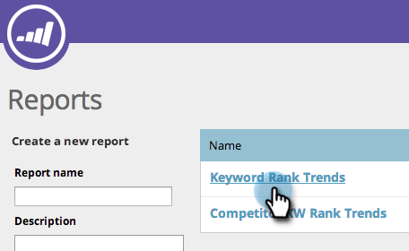

# SEO - Use the Keyword Trends Report {#seo-use-the-keyword-trends-report}

See how your keywords rank over time.

>[!IMPORTANT]
>
>On March 31, 2026, Marketo Engage [deprecated the Search Engine Optimization](https://nation.marketo.com/t5/product-blogs/marketo-engage-seo-feature-deprecation/ba-p/359060){target="_blank"} feature. [seo.marketo.com](https://seo.marketo.com/) is still available for a limited time. Follow the steps in articles below to export any data.
>
>* [Export Issues](https://experienceleague.adobe.com/en/docs/marketo/using/product-docs/additional-apps/seo/pages/seo-export-issues-to-csv){target="_blank"}
>* [Export Keyword Results](https://experienceleague.adobe.com/en/docs/marketo/using/product-docs/additional-apps/seo/keywords/seo-exporting-keyword-results){target="_blank"}
>* [Export Keyword Trends](https://experienceleague.adobe.com/en/docs/marketo/using/product-docs/additional-apps/seo/reports/seo-use-the-keyword-trends-report#exporting-data){target="_blank"}
>* [Export Competitor Keyword Trends](https://experienceleague.adobe.com/en/docs/marketo/using/product-docs/additional-apps/seo/reports/seo-use-the-competitor-kw-trends-report#exporting-data){target="_blank"}

## Load Report {#load-report}

1. Go to **[!UICONTROL Reports]**.

   

1. Click **[!UICONTROL Keyword Rank Trends]**.

   

   

   **Report Items**

   | Item |Description |
   |---|---|
   | [!UICONTROL Keywords]  |The number of keywords you are tracking. |
   | [!UICONTROL Ranking URLs]  |The number of URLs on your site ranking in the range you have set.  |
   | [!UICONTROL Avg. rank]  |The average rank of keywords in the range you have set.  |
   | [!UICONTROL Avg. searches]  |The average number of searches on those keywords that occurred during the range you set (in the last 30 days) on the Google US search |

## Filtering Data {#filtering-data}

1. Click the drop-down and select your desired time period.

   

1. Click the Rank drop-down to choose which rank range you want to view keywords for.

   

## Exporting Data {#exporting-data}

1. Click **[!UICONTROL Export CSV]** or **[!UICONTROL Export PDF]**.

   
