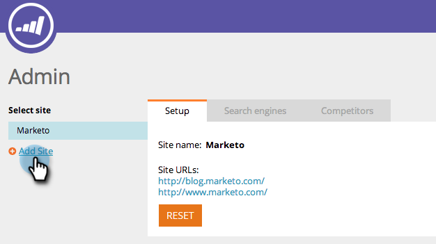
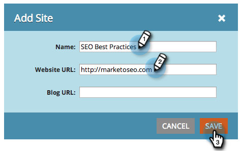
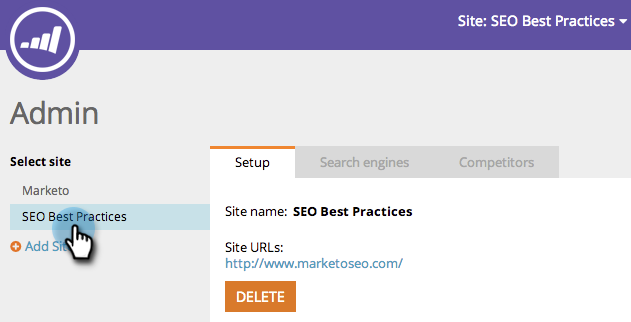

# SEO - Add a Site/Delete a Site {#seo-add-a-site-delete-a-site}

In order for Marketo to pull data (inbound links and recommendations) relevant to your site's pages, you must define the site's URL here.

>[!AVAILABILITY]
>
>Not all customers have purchased this functionality. Contact your sales rep for details.

## Add a Site {#add-a-site}

1. Click the Admin drop-down and select **Admin**.

   >[!NOTE]
   >
   >**Admin Permissions Required**

   

1. Click **Add Site**.

   

1. Enter the **Name, Website URL** and click **Save**.

   >[!TIP]
   >
   >You can also add a **Blog URL** if you have one.

   

   Great! You've just added another site.

   

## Delete a Site {#delete-a-site}

If you are tracking more than one site, you can also delete a site that you are no longer interested in optimizing.

1. Click the Admin drop-down and select **Admin**.

   

1. Click the site you'd like to remove.

   

1. Click **Delete**.

   

1. Confirm that you want to **Delete**.

   

   >[!NOTE]
   >
   >You can only delete a site if you have more than one. If you have just one, you can perform a reset by selecting the site and clicking **Reset**. Resetting a site will _delete all site data_ and recreate the site.
