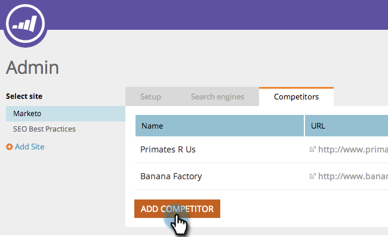
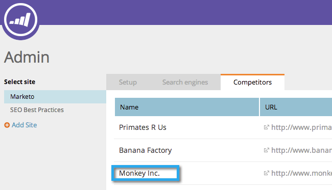

# SEO - Add Competitors {#seo-add-competitors}

Adding competitors will allow you to track how they are performing for the same keywords and inbound links you choose to monitor.

>[!NOTE]
>
>**Admin Permissions Required**

1. Go to the **Admin** section.

   

1. Click on the **Competitors** tab.

   

1. Click **Add Competitor**.

   

1. Type in the **Name** and **URL** of your competitor.

   

   High five! You should now see your competitor in the list.

   

   Congrats! You are one step closer to totally crushing it.

   >[!MORELIKETHIS]
   >
   >* [Add Keywords](/help/marketo//product-docs/additional-apps/seo/keywords/seo-add-keywords.md)
   >* [Understanding Keywords (Competitor View)](/help/marketo/product-docs/additional-apps/seo/keywords/seo-understanding-keywords.md)
