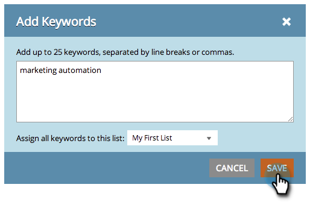

# SEO - Managing Lists {#seo-managing-lists}

You can add things to lists when you are adding keywords, pages, page issues, or inbound links. Lists help you stay organized and let you filter reports to only see data on that list. Here's how to make them.

>[!IMPORTANT]
>
>On March 31, 2026, Marketo Engage will deprecate the Search Engine Optimization feature. Please export any relevant data on or before March 30. [Learn more](https://nation.marketo.com/t5/product-blogs/marketo-engage-seo-feature-deprecation/ba-p/359060){target="_blank"}.
>
>* [Export Issues](https://experienceleague.adobe.com/en/docs/marketo/using/product-docs/additional-apps/seo/pages/seo-export-issues-to-csv){target="_blank"}
>* [Export Keyword Results](https://experienceleague.adobe.com/en/docs/marketo/using/product-docs/additional-apps/seo/keywords/seo-exporting-keyword-results){target="_blank"}
>* [Export Keyword Trends](https://experienceleague.adobe.com/en/docs/marketo/using/product-docs/additional-apps/seo/reports/seo-use-the-keyword-trends-report#exporting-data){target="_blank"}
>* [Export Competitor Keyword Trends](https://experienceleague.adobe.com/en/docs/marketo/using/product-docs/additional-apps/seo/reports/seo-use-the-competitor-kw-trends-report#exporting-data){target="_blank"}

1. Click **[!UICONTROL Add Keywords]**.

   >[!NOTE]
   >
   >This works the same way when adding pages, pages issues, and inbound links.

   

1. Enter the keyword. Select a list to add it to from the drop-down.

   

   >[!TIP]
   >
   >You can create a new list in the drop-down. Enter a title, hit the return key.

1. Click **[!UICONTROL Save]**.

   
