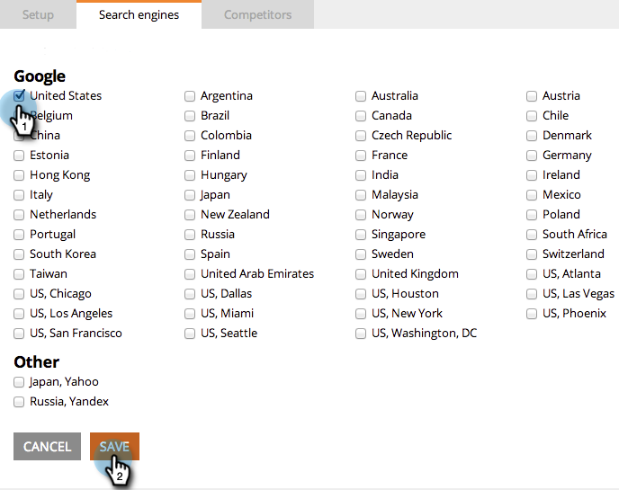
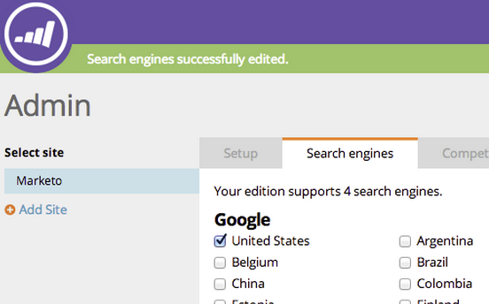

# SEO - Pick Region/Country for Your Search Engine {#seo-pick-region-country-for-your-search-engine}

SEO Admins will be able to pick the region for the search engine that you'd like to get keyword rank information.

>[!NOTE]
>
>**Admin Permissions Required**

1. Go to the **[!UICONTROL Admin]** section.

1. Click the **[!UICONTROL Search engines]** tab.

   

1. Pick which country/city you want to optimize for and click **[!UICONTROL Save]**.

>[!NOTE]
>
>By default, you can use one country for one search engine. If you need more, contact your sales rep.

Excellent work. You will now see keyword ranks for the country or city of your choosing.

>[!MORELIKETHIS]
>
>* [Understanding the Dashboard: SEO Snapshot](/help/marketo/product-docs/additional-apps/seo/understanding-seo/understanding-the-seo-dashboard-seo-snapshot.md){target="_blank"}
>* [Understanding the Dashboard: SEO Recommendations](/help/marketo/product-docs/additional-apps/seo/understanding-seo/understanding-the-seo-dashboard-seo-recommendations.md){target="_blank"}
