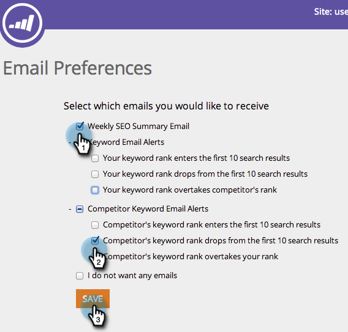

# SEO - Set Your Email Alert Preferences {#seo-set-your-email-alert-preferences}

You can customize your email preferences to determine when you'll be updated about your SEO efforts.

1. In the top navigation bar, click your user name. Click **Email Preferences**. 

   

1. Indicate what you'd like to be alerted about via email. 

   

   Groovy. Your preferences will autosave.

