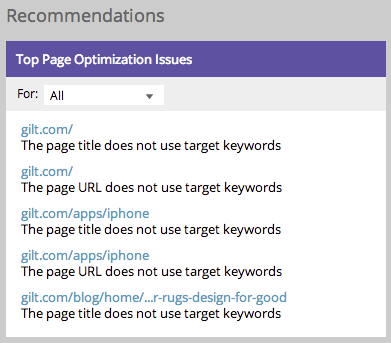
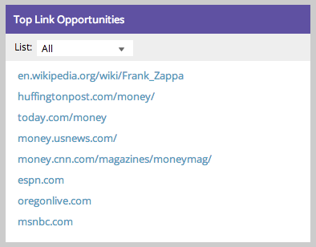

# Understanding the SEO Dashboard: SEO Recommendations {#understanding-the-seo-dashboard-seo-recommendations}

Use the dashboard to get a high-level view of how keyword ranks are trending and how well your site is optimized for SEO.

>[!IMPORTANT]
>
>On March 31, 2026, Marketo Engage will deprecate the Search Engine Optimization feature. Please export any relevant data on or before March 30. [Learn more](https://nation.marketo.com/t5/product-blogs/marketo-engage-seo-feature-deprecation/ba-p/359060){target="_blank"}.
>
>* [Export Issues](https://experienceleague.adobe.com/en/docs/marketo/using/product-docs/additional-apps/seo/pages/seo-export-issues-to-csv){target="_blank"}
>* [Export Keyword Results](https://experienceleague.adobe.com/en/docs/marketo/using/product-docs/additional-apps/seo/keywords/seo-exporting-keyword-results){target="_blank"}
>* [Export Keyword Trends](https://experienceleague.adobe.com/en/docs/marketo/using/product-docs/additional-apps/seo/reports/seo-use-the-keyword-trends-report#exporting-data){target="_blank"}
>* [Export Competitor Keyword Trends](https://experienceleague.adobe.com/en/docs/marketo/using/product-docs/additional-apps/seo/reports/seo-use-the-competitor-kw-trends-report#exporting-data){target="_blank"}

You can also find out how to improve using the [!UICONTROL Recommendations] section. Let's dive in!

## [!UICONTROL Top Page Optimization Issues] {#top-page-optimization-issues}

This will show you five high-impact ways to start optimizing your site right away! Just click on any of the links to view the full [Page Detail Drill Down](/help/marketo/product-docs/additional-apps/seo/pages/seo-using-the-page-detail-drill-down.md){target="_blank"}.

>[!TIP]
>
>You can click [!UICONTROL Top Page Optimization Issues] to see a full list.

## [!UICONTROL Top Link Opportunities] {#top-link-opportunities}

Having reputable sites link to your content can increase your page ranking. Here are some of the highest priority opportunities that we've found for you site.

>[!TIP]
>
>You can click on [!UICONTROL Top Link Optimization] to see a full list.

>[!MORELIKETHIS]
>
>[Page Detail Drill Down](/help/marketo/product-docs/additional-apps/seo/pages/seo-using-the-page-detail-drill-down.md){target="_blank"}
