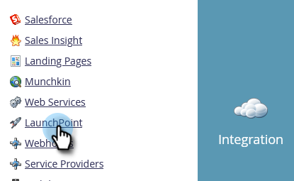
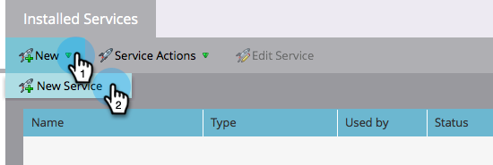
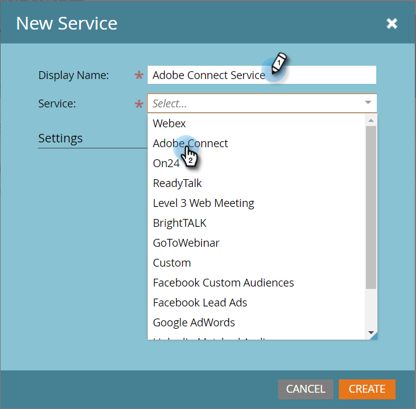
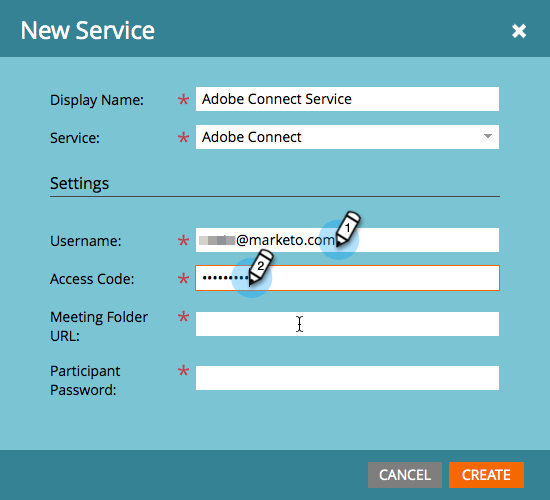
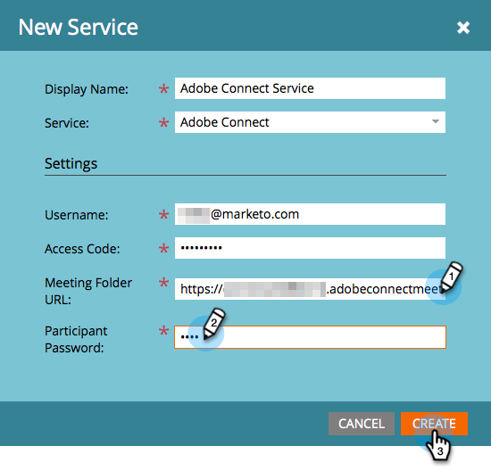
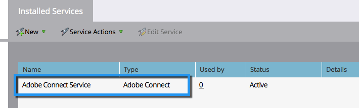

# Add Adobe Connect as a LaunchPoint Service {#add-adobe-connect-as-a-launchpoint-service}

Marketo manages your Adobe Connect webinar registration and attendance.

>[!NOTE]
>
>**Admin Permissions Required**

>[!NOTE]
>
>An existing subscription to Adobe Connect and administration rights are necessary for this step. Have the following settings at hand: username, password, participant password, and meeting folder URL.

>[!NOTE]
>
>Adobe Connect On Site is not currently supported.

1. Go to the **Admin** area.

   

1. Click **LaunchPoint**.

   

1. Click the **New** drop-down and select **New Service**.

   

1. Enter a **Display Name**. Under **Service**, select Adobe Connect.

   

1. Enter your **Username** and **Access Code**.

   

1. Complete the process by entering your **Meeting Folder URL** and **Participant Password**,then click **Create**.

   

   >[!TIP]
   >
   >When you create the participant password, the value you choose is included in a query string when the links are sent out for the event. So, we suggest that you make it customer-friendly.

   >[!NOTE]
   >
   >Once you've logged into your Adobe Connect account, select the **Seminars** tab. Without drilling down into any specific seminar, copy the URL from your browser bar into the **Meeting Folder URL** setting.

Your Adobe Connect Service is now synced with Marketo!

   

>[!MORELIKETHIS]
>
>Learn how to [create an event with Adobe Connect](/help/marketo/product-docs/demand-generation/events/create-an-event/create-an-event-with-adobe-connect.md){target="_blank"}.
