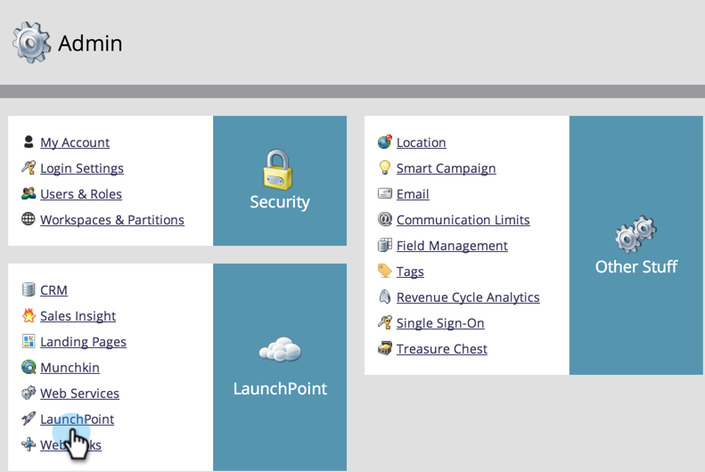
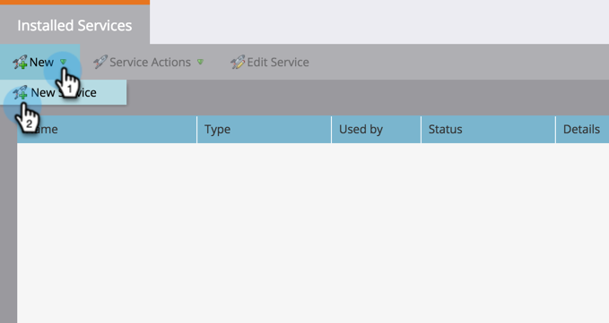
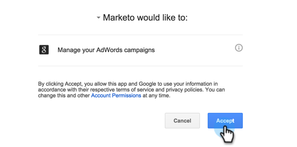
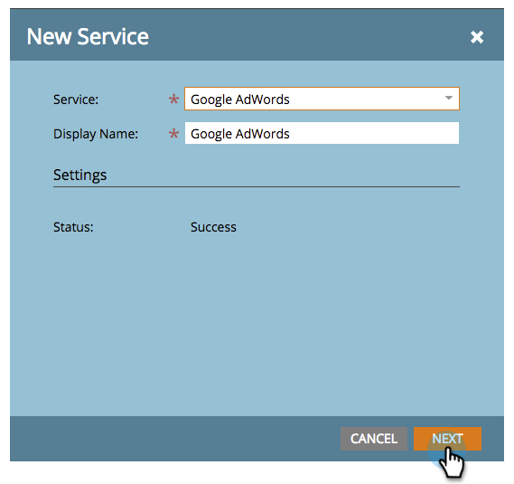
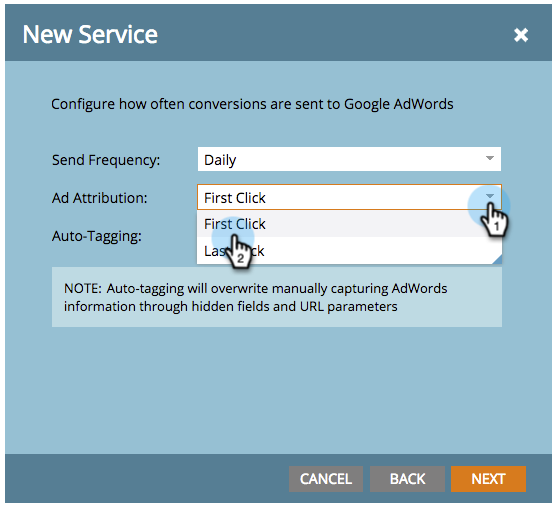

# Add Google AdWords as a Launchpoint Service with a Manager Account {#add-google-adwords-as-a-launchpoint-service-with-a-manager-account}

Link your Google AdWords account to Marketo to automatically upload offline conversion data from Marketo to Google AdWords. Then, from the AdWords UI, you will be able to easily see which clicks resulted in qualified leads, opportunities and new customers (or whatever revenue stages you want to track) after you  [add custom columns](https://support.google.com/adwords/answer/3073556) in AdWords. This information does not appear in the Marketo UI..

If you have multiple Google Adwords accounts, you can use a  [Google AdWords Manager Account](https://www.google.com/adwords/manager-accounts/) (formerly known as My Client Center) to integrate them with Marketo.

Learn more about [Google’s offline conversion import feature](https://support.google.com/adwords/answer/2998031?hl=en).

>[!NOTE]
>
>**Admin Permissions Required**

>[!NOTE]
>
>You can also integrate a [stand-alone Google AdWords account as a Launchpoint service](add-google-adwords-as-a-launchpoint-service.md).

1. Go to the **Admin** section.

   

1. Select **LaunchPoint**.

   

1. Select **New** and **New Service**.

   

1. Enter a Display Name and select **Google AdWords**.

   

1. Select **Authorize Marketo**.

   >[!NOTE]
   >
   >Make sure to log out of your personal Gmail account and enable pop-ups.

   

1. Select your account associated with **Google AdWords**.

   

1. Select **Accept**.

   

1. Status will display as **Success**. Select **Next**.

   

1. Upload your offline conversions from Marketo to Google AdWords **Weekly **or **Daily**.

   

1. Attribute conversion to the **First Click** or **Last Click**.

   | Type |Definition |
   |---|---|
   | First Click |Offline conversions will be attributed to the first AdWords ad that a person clicked in the past 90 days |
   | Last Click |Offline conversions will be attributed to the last AdWords ad that a person clicked |

   

   >[!NOTE]
   >
   >[Auto-tagging](https://support.google.com/adwords/answer/1752125?hl=en) must be selected for this feature to work. It must be activated inside AdWords.

1. Click **Next**.

   

1. Deselect accounts you do not want to update. Click **Create**.

   

   Yippee! Now see the Related Article below for how to map AdWords offline conversions in your revenue model.

   >[!NOTE]
   >
   >**Related Articles**
   >
   >    
   >    
   >    * [Set Google AdWords Conversions in the Revenue Model with a Manager Account](../../../product-docs/reporting/revenue-cycle-analytics/revenue-cycle-models/set-google-adwords-conversions-in-the-revenue-model-with-a-manager-account.md)
   >    
   >

