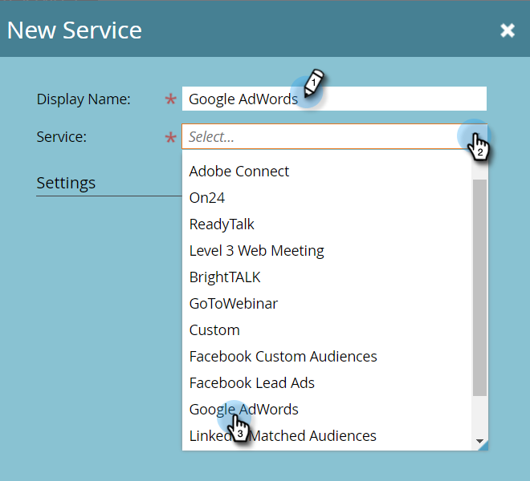
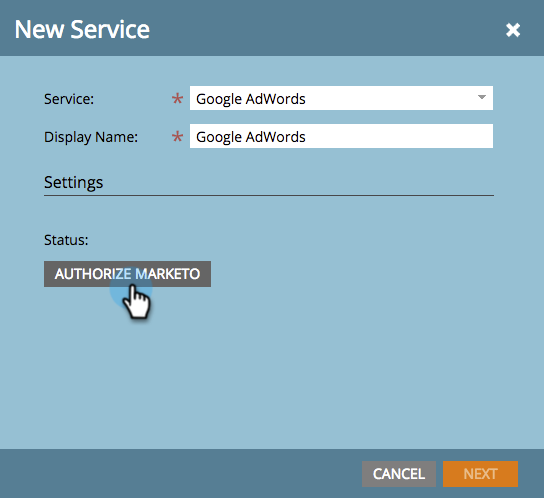
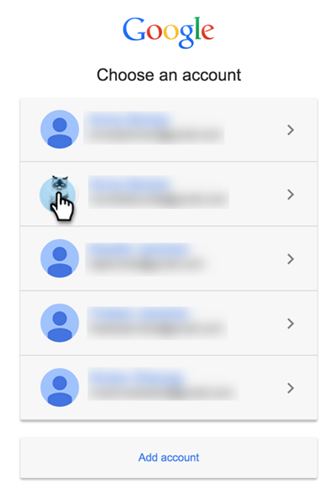
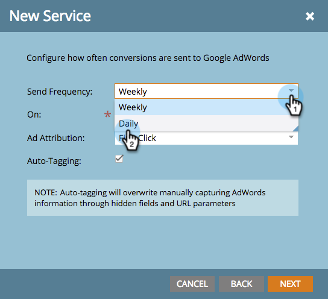

# Add [!DNL Google AdWords] as a [!DNL Launchpoint] Service with a Manager Account {#add-google-adwords-as-a-launchpoint-service-with-a-manager-account}

Link your [!DNL Google AdWords] account to Marketo to automatically upload offline conversion data from Marketo to [!DNL Google AdWords]. Then, from the [!DNL AdWords] UI, you will be able to easily see which clicks resulted in qualified leads, opportunities and new customers (or whatever revenue stages you want to track) after you  [add custom columns](https://support.google.com/adwords/answer/3073556){target="_blank"} in [!DNL AdWords]. This information does not appear in the Marketo UI.

If you have multiple [!DNL Google Adwords] accounts, you can use a [[!DNL Google AdWords Manager Account]](https://www.google.com/adwords/manager-accounts/){target="_blank"} (formerly known as [!DNL My Client Center]) to integrate them with Marketo.

Learn more about [Google's offline conversion import feature](https://support.google.com/adwords/answer/2998031?hl=en){target="_blank"}.

>[!AVAILABILITY]
>
>Not all customers have purchased this feature. Please contact the Adobe Account Team (your Account Manager) for details.

>[!NOTE]
>
>**Admin Permissions Required**

>[!NOTE]
>
>You can also integrate a [stand-alone [!DNL Google AdWords] account as a [!DNL Launchpoint] service](/help/marketo/product-docs/administration/additional-integrations/add-google-adwords-as-a-launchpoint-service.md){target="_blank"}.

1. Go to the **[!UICONTROL Admin]** area.

   

1. Select **[!UICONTROL LaunchPoint]**.

   

1. Click the **[!UICONTROL New]** drop-down and select **[!UICONTROL New Service]**.

   

1. Enter a **[!UICONTROL Display Name]** and select **[!UICONTROL Google AdWords]**.

   

1. Select **[!UICONTROL Authorize Marketo]**.

   >[!NOTE]
   >
   >Make sure to log out of your personal [!DNL Gmail] account and enable pop-ups.

   

1. Select your account associated with **[!DNL Google AdWords]**.

   

1. Click **[!UICONTROL Accept]**.

   

1. Status will display as **[!UICONTROL Success]**. Select **[!UICONTROL Next]**.

   

1. Upload your offline conversions from Marketo to [!DNL Google AdWords] **[!UICONTROL Weekly]** or **[!UICONTROL Daily]**.

   

1. Attribute conversion to the **[!UICONTROL First Click]** or **[!UICONTROL Last Click]**.

   

   | Type |Definition |
   |---|---|
   | [!UICONTROL First Click] |Offline conversions will be attributed to the first [!DNL AdWords] ad that a person clicked in the past 90 days |
   | [!UICONTROL Last Click] |Offline conversions will be attributed to the last [!DNL AdWords] ad that a person clicked |

   >[!NOTE]
   >
   >[Auto-tagging](https://support.google.com/adwords/answer/1752125?hl=en){target="_blank"} must be selected for this feature to work. It must be activated inside [!DNL AdWords].

1. Click **[!UICONTROL Next]**.

   

1. Deselect accounts you do not want to update. Click **[!UICONTROL Create]**.

   

   Now see the Related Article below for how to map [!DNL AdWords] offline conversions in your revenue model.

   >[!MORELIKETHIS]
   >
   >[Set [!DNL Google AdWords] Conversions in the Revenue Model with a Manager Account](/help/marketo/product-docs/reporting/revenue-cycle-analytics/revenue-cycle-models/set-google-adwords-conversions-in-the-revenue-model-with-a-manager-account.md){target="_blank"}
