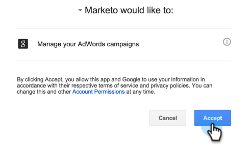
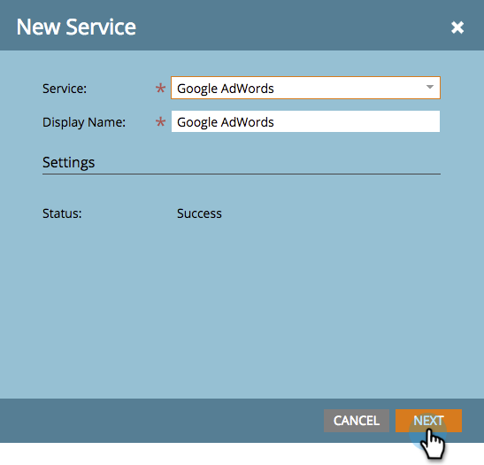
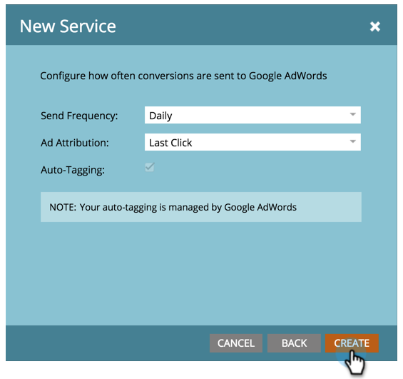

# Add [!DNL Google AdWords] as a [!DNL LaunchPoint] Service {#add-google-adwords-as-a-launchpoint-service}

Link your [!DNL Google AdWords] account to Marketo to automatically upload offline conversion data from Marketo to [!DNL Google AdWords]. Then, from the [!DNL AdWords] UI, you will be able to easily see which clicks resulted in qualified leads, opportunities, and new customers (or whatever revenue stages you want to track) after you [add custom columns](https://support.google.com/adwords/answer/3073556){target="_blank"} in [!DNL AdWords]. This information does not appear in the Marketo UI.

Learn more about [Google’s offline conversion import feature](https://support.google.com/adwords/answer/2998031?hl=en){target="_blank"}.

>[!AVAILABILITY]
>
>Not all customers have purchased this feature. Please contact your Customer Success Manager for details.

>[!NOTE]
>
>**Admin Permissions Required**

>[!NOTE]
>
>You can also integrate a [[!DNL Google AdWords] as a [!DNL Launchpoint] service with a manager account](/help/marketo/product-docs/administration/additional-integrations/add-google-adwords-as-a-launchpoint-service-with-a-manager-account.md){target="_blank"}.

1. Go to the **[!UICONTROL Admin]** section.

   

1. Select **[!UICONTROL LaunchPoint]**.

   

1. Select **[!UICONTROL New]** and **[!UICONTROL New Service]**.

   

1. Enter a [!UICONTROL display name] and select **[!UICONTROL Google AdWords]**.

   

1. Select **[!UICONTROL Authorize Marketo]**.

   >[!NOTE]
   >
   >Make sure to log out of your personal [!DNL Gmail] account and enable pop-ups.

   

1. Select your account associated with [!DNL Google AdWords].

   

1. Select **[!UICONTROL Accept]**.

   

1. Status will display as **[!UICONTROL Success]**. Select **[!UICONTROL Next]**.

   

1. Upload your offline conversions from Marketo to [!DNL Google AdWords] **[!UICONTROL Weekly]** or **[!UICONTROL Daily]**.

   

1. Attribute conversion to the **[!UICONTROL First Click]** or **[!UICONTROL Last Click]**.

   

   | Type |Definition |
   |---|---|
   | [!UICONTROL First Click] |Offline conversions will be attributed to the first [!DNL AdWords] ad that a person clicked in the past 90 days |
   | [!UICONTROL Last Click] |Offline conversions will be attributed to the last [!DNL AdWords] ad that a person clicked |

   >[!NOTE]
   >
   >Using a consistent attribution model in Marketo and [!DNL AdWords] provides the most accurate data.

1. Click **[!UICONTROL Create]**.

   

   >[!NOTE]
   >
   >[Auto-tagging](https://support.google.com/adwords/answer/1752125?hl=en){target="_blank"} must be selected for this feature to work. Deactivation must be done inside [!DNL AdWords].

Great! Now see the Related Article below to learn how to map [!DNL AdWords] offline conversions in your revenue model.

   >[!MORELIKETHIS]
   >
   >[Set [!DNL Google AdWords] Conversions in the Revenue Model](/help/marketo/product-docs/reporting/revenue-cycle-analytics/revenue-cycle-models/set-google-adwords-conversions-in-the-revenue-model.md){target="_blank"}
