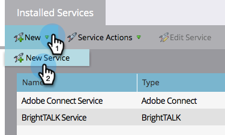
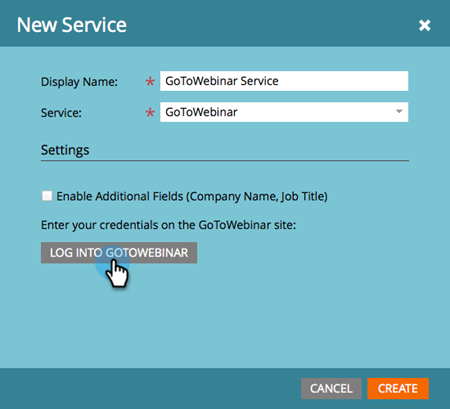
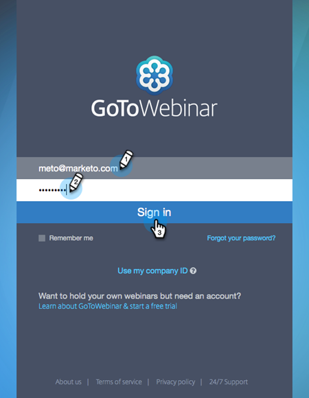
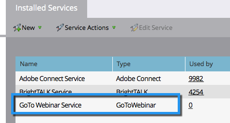

# Add [!DNL GoToWebinar] as a [!DNL LaunchPoint] Service {#add-gotowebinar-as-a-launchpoint-service}

Marketo manages your [!DNL GoToWebinar] registration and attendance.

>[!NOTE]
>
>**Admin Permissions Required**

>[!NOTE]
>
>An existing subscription to [!DNL GoToWebinar] and administration rights are necessary for this step. Have the email and password you use to sign on to [!DNL GoToWebinar] at hand.

>[!NOTE]
>
>[!DNL GoToMeeting], [!DNL GoToWebcast], and [!DNL GoToTraining] are not currently supported.

1. Go to the **[!UICONTROL Admin]** area.

   

1. Click **[!UICONTROL LaunchPoint]**.

   

1. Select **[!UICONTROL New]** and **[!UICONTROL New Service]**.

   

1. Enter a **[!UICONTROL Display Name]**. Under **[!UICONTROL Service]**, select **[!UICONTROL GoToWebinar]**.

   

1. Next, click **[!UICONTROL Log Into GoToWebinar]**.

   

   >[!NOTE]
   >
   >If you want to sync Company Name and Job Title from your Marketo form to [!DNL GoToWebinar], select the **[!UICONTROL Enable Additional Fields]** box.

1. In the [!DNL GoToWebinar] Sign In pop-up window, enter your **[!UICONTROL GoToWebinar]** email and password and click **[!UICONTROL Sign In]**.

   

1. After the window closes, click **[!UICONTROL Create]**.

   

1. Great! Your **[!UICONTROL GoToWebinar]** account is now synced with Marketo.

   

>[!CAUTION]
>
>When you update your password in [!DNL GoToWebinar], you must update your password in Marketo as well.

>[!MORELIKETHIS]
>
>Learn how to [create an event with [!DNL GotoWebinar]](/help/marketo/product-docs/demand-generation/events/create-an-event/create-an-event-with-gotowebinar.md){target="_blank"}.
