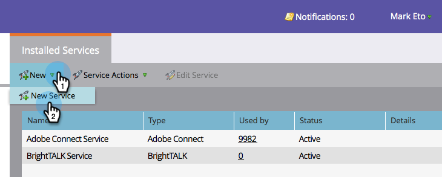
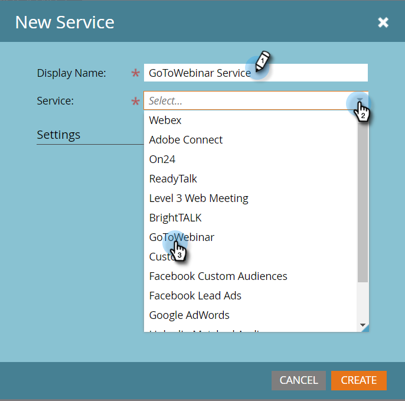
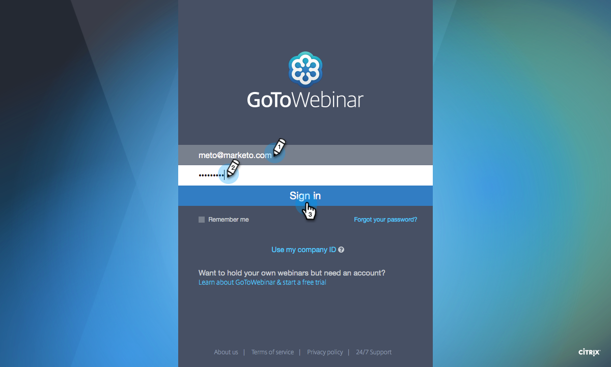

# Add GoToWebinar as a LaunchPoint Service {#add-gotowebinar-as-a-launchpoint-service}

Marketo manages your GoToWebinar registration and attendance.

>[!NOTE]
>
>**Admin Permissions Required**

>[!NOTE]
>
>**Reminder**
>
>An existing subscription to GoToWebinar and administration rights are necessary for this step. Have the email and password you use to sign on to GoToWebinar at hand.

>[!NOTE]
>
>GoToMeeting, GoToWebcast, and GoToTraining are not currently supported.

1. Go to **Admin** and select **LaunchPoint**.

   

1. Select **New** and **New Service**.

   

1. `Enter a **Display Name**. Under **Service**, select`**GoToWebinar**.

   

1. Next, click **Log Into** **GoToWebinar**.

   

   >[!NOTE]
   >
   >If you want to sync Company Name and Job Title from your Marketo form to GoToWebinar, select the **Enable Additional Fields** box.

1. In the GoToWebinar Sign In pop-up window, enter your **GoToWebinar** email and password and click **Sign In**.

   

1. After the window closes, click **Create**.

   

1. Great! Your **GoToWebinar** account is now synced with Marketo.

   

>[!CAUTION]
>
>When you update your password in GoToWebinar, you must update your password in Marketo as well.

>[!NOTE]
>
>**Related Articles**
>
>Learn how to [create an event with GotoWebinar](../../../product-docs/demand-generation/events/create-an-event/create-an-event-with-gotowebinar.md).

