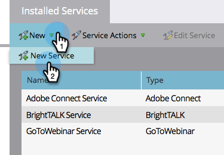
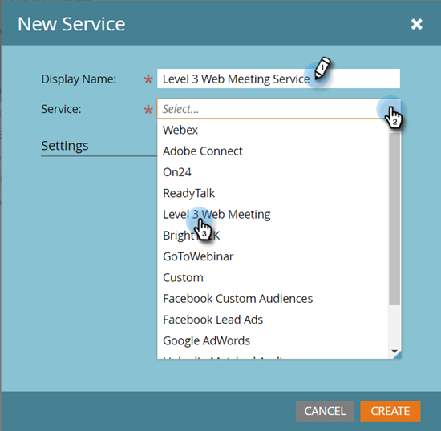
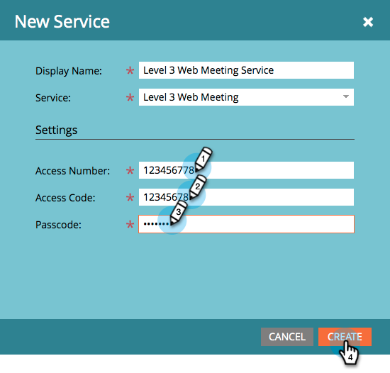
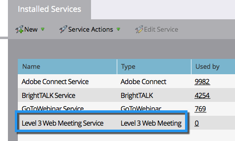

# Add [!DNL Level 3 Web Meeting] as a [!DNL LaunchPoint] Service {#add-level-three-web-meeting-as-a-launchpoint-service}

Marketo manages your [!DNL Level 3 Web Meeting] registration and attendance.

>[!NOTE]
>
>**Admin Permissions Required**

>[!NOTE]
>
>An existing subscription to [!DNL Level 3 Web Meeting] and administration rights are necessary for this step. Have your Access Number, Access Code, and Passcode at hand.

1. Go to the **[!UICONTROL Admin]** area.

   

1. Click **[!UICONTROL LaunchPoint]**.

   

1. Select **[!UICONTROL New]** and then **[!UICONTROL New Service]**.

   

1. Enter a **[!UICONTROL Display Name]**. Under **[!UICONTROL Service]**, select **[!UICONTROL Level 3 Web Meeting]**.

   

1. Enter your **[!UICONTROL Access Number]**, **[!UICONTROL Access Code]**, and **[!UICONTROL Passcode]**, then click **[!UICONTROL Create]**.

   

Your [!DNL Level 3 Web Meeting] Account is now synced with Marketo!

   

>[!MORELIKETHIS]
>
>Learn how to [create an event with a [!DNL Level 3 Web Meeting]](/help/marketo/product-docs/demand-generation/events/create-an-event/create-an-event-with-level-3-web-meeting.md){target="_blank"}.
