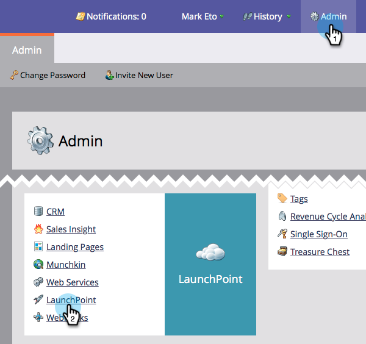
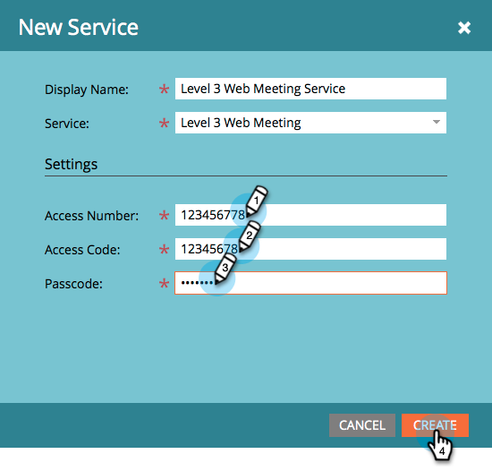
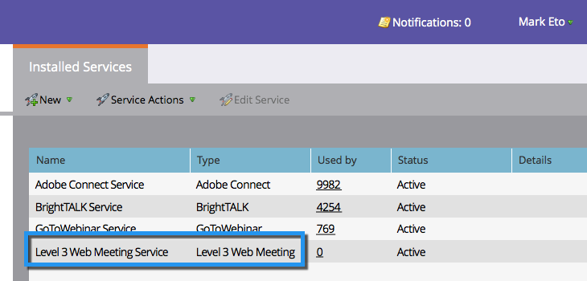

# Add Level 3 Web Meeting as a LaunchPoint Service {#add-level-web-meeting-as-a-launchpoint-service}

Marketo manages your Level 3 Web Meeting registration and attendance.

>[!NOTE]
>
>**Admin Permissions Required**

>[!NOTE]
>
>**Reminder**
>
>An existing subscription to Level 3 Web Meeting and administration rights are necessary for this step. Have your Access Number, Access Code, and Passcode at hand.

1. Go to **Admin** and select **LaunchPoint**.

   

1. Select **New** and then **New** **Service**.

   

1. Enter a **Display** **Name**. Under **Service**, select **Level 3 Web Meeting**.

   

1. Enter your **Access** **Number**, **Access** **Code**, and **Passcode**, then click **Create**.

   

1. Phenomenal! Your** Level 3 Web Meeting** Account is now synced with Marketo. 

   

>[!NOTE]
>
>**Related Articles**
>
>Learn how to [create an event with a Level 3 Web Meeting](../../../product-docs/demand-generation/events/create-an-event/create-an-event-with-level-3-web-meeting.md).

