# Add Munchkin Tracking Code to Your Website {#add-munchkin-tracking-code-to-your-website}

Marketo's custom JavaScript tracking code, called Munchkin, tracks all individuals who visit your website so you can react to their visits with automated marketing campaigns. Even anonymous visitors are tracked along with their IP addresses and other information. **Without this tracking code, you will not be able to track visits or other activity on your website**!

>[!PREREQUISITES]
>
>Please ensure that you have access to an experienced JavaScript developer. Marketo Technical Support is not set up to assist with troubleshooting custom JavaScript.

## Add Tracking Code to Your Website {#add-tracking-code-to-your-website}

>[!NOTE]
>
>Adobe Experience Cloud customers can also use Marketo's integration in Adobe Launch to include Munchkin script on their web pages. Get the app [here](https://www.adobeexchange.com/experiencecloud.details.101054.html).

1. Go to the **Admin** area.

   

1. Click **Munchkin**.

   

1. Select Asynchronous for Tracking Code Type.

   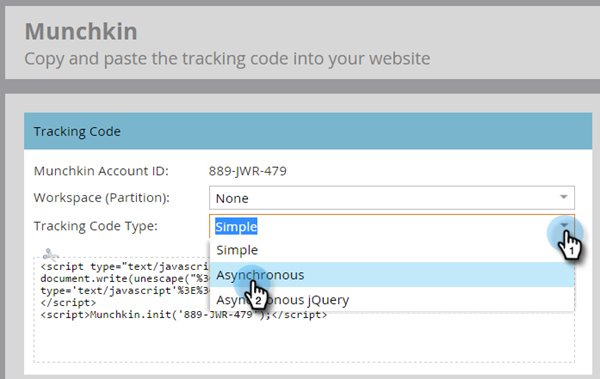

   >[!NOTE]
   >
   >In almost all cases, you should use the asynchronous code. [Learn more](#types-of-munchkin-tracking-codes).

1. Click and copy the Javascript tracking code to put on your website.

   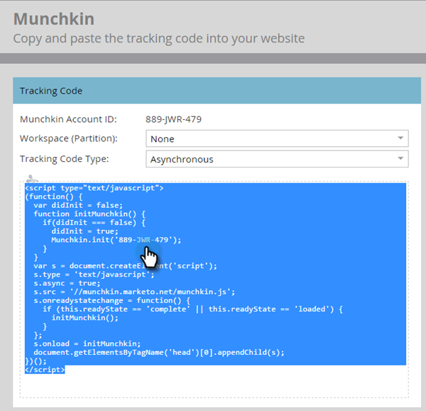

   >[!CAUTION]
   >
   >Don't use the code shown in this screenshot - you must use the unique code that appears in your account!

   >[!TIP]
   >
   >Put tracking code on the web pages you want to track. This may be every page for smaller sites, or only key pages on sites that have many dynamically generated Web pages, user forums, and so on.

   For best results, use the asynchronous Munchkin code and place it inside the `<head>` elements of your pages. If you are using the simple code (not recommended), this is right before the `</body>` tag.

   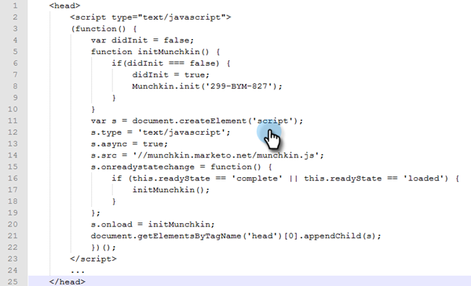

   >[!TIP]
   >
   >For sites that see a high volume of traffic (i.e., hundreds of thousands of visits per month), we recommend you opt not to track anonymous people. [Learn more](https://developers.marketo.com/documentation/websites/lead-tracking-munchkin-js/).

## Add Tracking Code When Using Multiple Workspaces {#add-tracking-code-when-using-multiple-workspaces}

If you're using Workspaces in your Marketo account, you probably also have separate web presences that correspond to your workspaces. In that case, you can use the Munchkin tracking Javascript to assign your anonymous people to the correct workspace and partition.

1. Go to the **Admin** area.

   

1. Click **Munchkin**.

   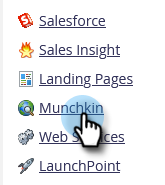

1. Select the appropriate workspace for the web pages you wish to track.

   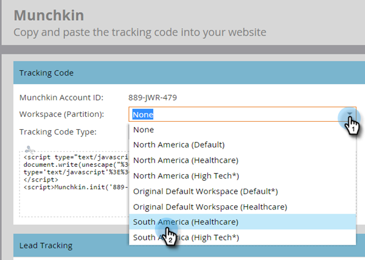

   >[!NOTE]
   >
   >If you don't use the special workspace Munchkin code, the people will be assigned to the default partition that was created when your account was set up. It's named "Default" initially, but you might have changed that in your own Marketo account.

1. Select **Asynchronous** for Tracking Code Type.

   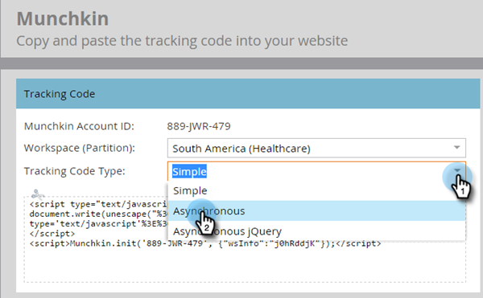

1. Click and copy the JavaScript tracking code to put on your website.

   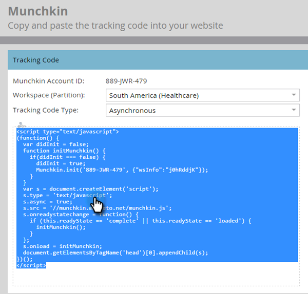

   >[!CAUTION]
   >
   >Don't use the code shown in this screenshot - you must use the unique code that appears in your account!

1. Place the tracking code on your web pages in the `<head>` element. New people that visit this page will be assigned to this partition.

   

   >[!CAUTION]
   >
   >You can only use one Munchkin tracking script for a single partition and workspace on a page. Do not include tracking scripts for multiple partitions/workspaces on your website.

   >[!NOTE]
   >
   >Landing pages created in Marketo automatically contain tracking code, so you don't need to put this code on them.

## Types of Munchkin Tracking Codes {#types-of-munchkin-tracking-codes}

There are three types of Munchkin tracking codes you can choose from. Each impact the webpage load times differently.

1. **Simple**: has the fewest lines of code, but does not optimize for webpage loading time. This code loads the jQuery library each time a webpage is loaded.
1. **Asynchronous**: reduces webpage loading time.
1. **Asynchronous jQuery**: reduces webpage loading time and also improves system performance. This code assumes that you already have jQuery, and does not check to load it.

## Test if Your Munchkin Code is Working {#test-if-your-munchkin-code-is-working}

To check that your Munchkin code is working after you've added it:

1. Visit your web page.

1. In your My Marketo, click the **Analytics** tile.

   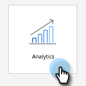

1. Click **Web Page Activity**.

   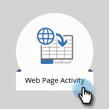

1. Click the **Setup** tab, double-click **Activity Source**. 

   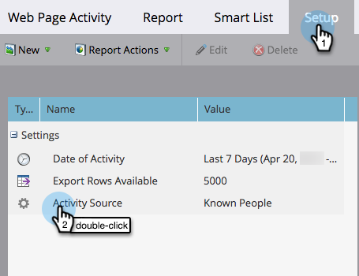

1. Change the Activity Source to **Anonymous Visitors (including ISPs)** and click **Apply**.

   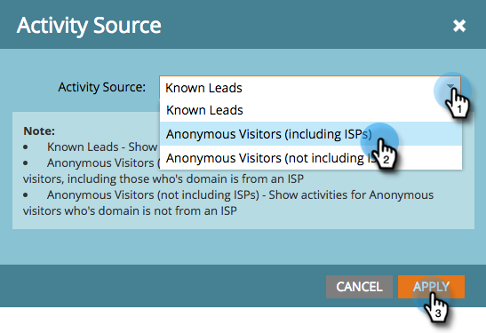

1. Click the **Report** tab. 

   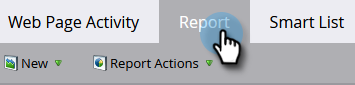

   >[!NOTE]
   >
   >If you don't see any data, wait a few minutes, then click the refresh icon at the bottom.
