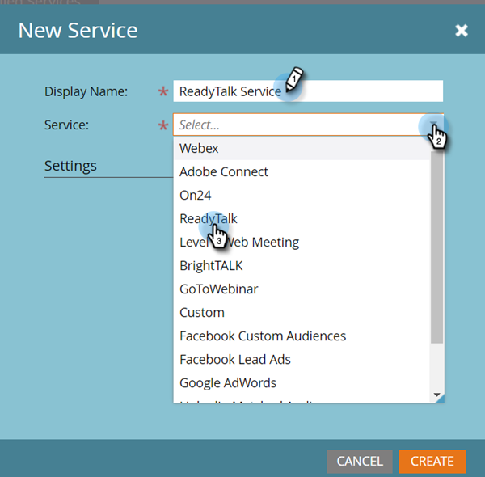
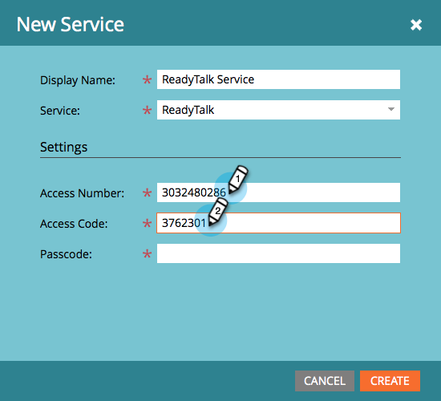
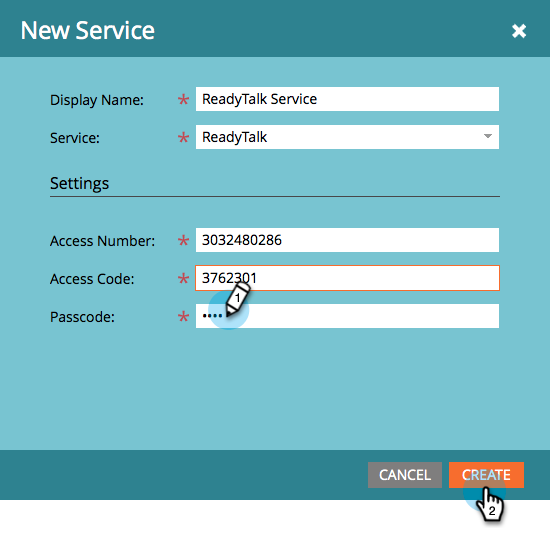
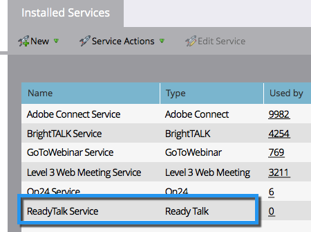

# Add ReadyTalk as a LaunchPoint Service {#add-readytalk-as-a-launchpoint-service}

Marketo manages your ReadyTalk webinar registration and attendance.

>[!NOTE]
>
>**Admin Permissions Required**

>[!NOTE]
>
>An existing subscription to ReadyTalk and administration rights are necessary for this step. Have the following settings at hand: Access Number, Access Code, and Passcode.

1. Go to the **Admin** area. 

   

1. Click **LaunchPoint**.

   

1. Select **New** and then **New Service**.

   

1. Enter a **Display Name**. Under **Service**, select **ReadyTalk**.

   

1. Enter your **Access Number** and **Access Code**.

   

1. Complete the process by entering your **Passcode** and click **Create**.

   

Your **ReadyTalk** account is now synced with Marketo.

   

>[!MORELIKETHIS]
>
>Learn how to [create an event with ReadyTalk](/help/marketo/product-docs/demand-generation/events/create-an-event/create-an-event-with-readytalk.md).
