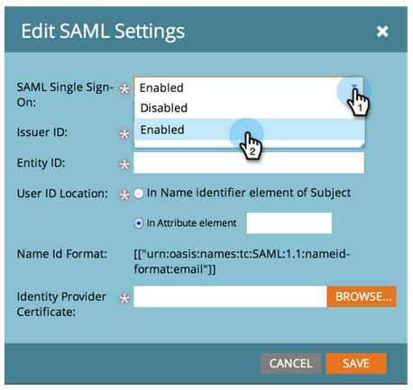
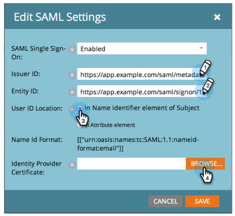
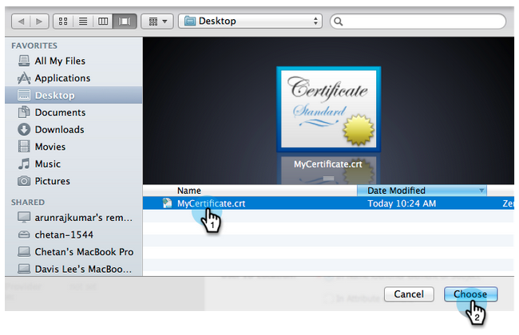
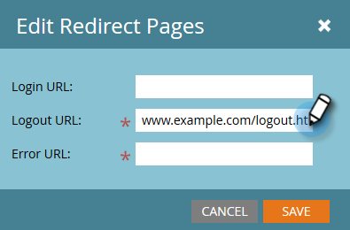

# Add Single Sign-On to a Portal {#add-single-sign-on-to-a-portal}

If you have a directory service that authenticates users, you can allow single sign-on (SSO) into Marketo. We support this feature using Security Assertion Markup Language (SAML) version 2.0 and higher.

Marketo functions as a SAML Service Provider (SP), and depends on an external Identity Provider (IdP) to authenticate users.

Once SSO is enabled, the IdP can validate a user’s credentials. When a user wishes to use Marketo software, the IdP then sends a signed SAML message to Marketo, acting as the SP. This message vouchsafes to Marketo that the user is authorized to use Marketo software.

>[!NOTE]
>
>**Admin Permissions Required**

>[!NOTE]
>
>Are you a Microsoft Azure user? Check out their [integration tutorial](https://azure.microsoft.com/en-us/documentation/articles/active-directory-saas-marketo-tutorial/).

## How to Send the Request {#how-to-send-the-request}

* Send the SSO request, which is a SAML response, to `https://login.marketo.com/saml/assertion/<your-munchkin-id>`
* As the SP’s Audience URL. Use `http://saml.marketo.com/sp`
* If you are using the SPNameQualifier attribute, set the NameID element for Subject to `http://saml.marketo.com/sp`
* If you are federating multiple Marketo subscriptions to the same SSO provider, you can use unique SP urls for each Marketo sub with the format `http://saml.marketo.com/sp/<munchkin_id>`

>[!NOTE]
>
>Marketo only supports Identity Provider-initiated (also known as IdP-initiated), in which the user first launches the Idp login page, authenticates, then navigates to My Marketo.

## Additional Notes {#additional-notes}

* **Sync-up time** - For a new user, there is about a 10 minute delay before an initial SSO request is processed.
* **User Provisioning** - Users are provisioned manually by Marketo.
* **Authorization** - User permissions are maintained within Marketo.
* **OAuth support** - Marketo does not currently support OAuth.
* **Automatic User Propagation** - Also known as "Just in Time Provisioning," this is when a user's first SAML login is capable of creating the user in whatever web application they're accessing (e.g., Marketo) and no manual admin action is required. This is not supported by Marketo at this time.
* **Encryption** - Marketo does not currently support encryption.

>[!NOTE]
>
>Before starting, have your Identity Provider Certificate in X.509 format and in .crt, .der, or .cer extension.

## Update SAML Settings {#update-saml-settings}

SSO is disabled by default. Follow these steps to enable SAML and configure it.

1. Go to **Admin** and click **Single Sign-On**.

   

   >[!NOTE]
   >
   >If you don't see **Single Sign-On** under **Admin**, contact [Marketo Support](https://nation.marketo.com/t5/Support/ct-p/Support).

1. Under the **SAML Settings** section, click on **Edit**.

   

1. Change **SAML Single Sign-On** to **Enabled**.

   

1. Enter your **Issuer ID**, **Entity ID**, select the **User ID Location**, then click **Browse**.

   

1. Select your **Identity Provider Certificate** file.

   

1. Click **Save**.

   

## Update Redirect Page Settings {#update-redirect-page-settings}

1. Under the **Redirect Pages** section, click **Edit**.

   

   >[!NOTE]
   >
   >Customers using Universal ID along with SSO must enter the login URL of the Identity Provider in the **Login URL** field.

1. Enter a **Logout URL**. This is the URL you want the user to be directed to when they log out of Marketo.

   

1. Enter an **Error URL**. This is the URL you want the user to be directed to in case logging into Marketo fails. Click **Save**.

   

   >[!NOTE]
   >
   >Both of these pages must be publicly available.

>[!MORELIKETHIS]
>
>* [Using a Universal ID for Subscription Login](/help/marketo/product-docs/administration/settings/using-a-universal-id-for-subscription-login.md)
>* [Restrict User Login to SSO Only](/help/marketo/product-docs/administration/additional-integrations/restrict-user-login-to-sso-only.md)
>* [Inviting Marketo Users to Two Instances with Universal ID](https://nation.marketo.com/t5/Knowledgebase/Inviting-Marketo-Users-to-Two-Instances-with-Universal-ID-UID/ta-p/251122)
