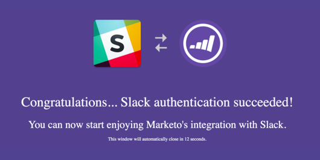

# Add Slack as a LaunchPoint Service {#add-slack-as-a-launchpoint-service}

There are two notification types included in the Slack integration:

* **System notifications**: Get Slack notifications regarding important events in your Marketo instance, like alerts about current campaign statuses and any issues that require immediate attention (CRM errors and API limits).
* **Interesting moments**: When a Marketo Insight has been triggered by a known individual from a sales account, lead owners can be notified via Slack. Notifications include lead information as well as details about the sales account.

>[!NOTE]
>
>**Admin Permissions Required**

>[!NOTE]
>
>**Prerequisites**
>
>If you don't have Slack System Notifications already enabled, please [contact Support](http://docs.marketo.com/cdn-cgi/l/email-protection#ed9e989d9d829f99ad808c9f86889982c38e8280).

1. Go to **LaunchPoint**, then under **New** click **New Service**.

   

1. Enter a display name for your Slack integration. In the **Service** drop-down, select **Slack**. Click **Create**.

   

1. Click **Authorize**. This opens Slack in a new tab, where you will complete the authorization and grant Marketo permission to pull information from Slack.

   

1. In the new Slack tab, enter your workspace's URL and click **Continue**.

   

1. Enter your Slack credentials and click **Sign in**.

   

1. In the **Post to** drop-down, select the channel where you want notifications from Marketo to be posted. Review the requested permissions, then click **Authorize**.

   

1. You should see the confirmation screen below. The tab closes automatically.

   

1. Refresh the Marketo tab and confirm that Slack is now listed as an active service in LaunchPoint.

   

   Notifications will now begin posting to the channel you selected in step 6. They'll look something like this:

   

