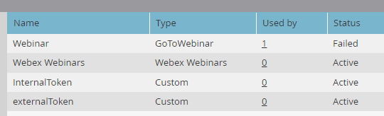

# Add [!DNL Webex] as a [!DNL LaunchPoint] Service {#add-webex-as-a-launchpoint-service}

Marketo Engage manages your [!DNL Webex] webinar registration and attendance. You must have an existing subscription to [[!UICONTROL Webex]](https://www.webex.com/).

>[!NOTE]
>
>**Admin Permissions Required**

1. Go to the **[!UICONTROL Admin]** area. 

   

1. Click **[!UICONTROL LaunchPoint]**.

   

1. Select **[!UICONTROL New]** and then **[!UICONTROL New Service]**.

   

1. Enter a **[!UICONTROL Display Name]**. In the **[!UICONTROL Service]** drop-down, select **[!UICONTROL Webex Webinars]**.

   

1. Click **[!UICONTROL Log Into Webex Webinars]**.

   

1. Webex will open in a new tab. Log in using your Webex credentials.

   

1. Upon successful login, the tab will close and the _New Service_ modal in Marketo Engage will read "Webex Webinars account is set." Click **[!UICONTROL Create]**.

   

Your **[!DNL Webex]** is now synced with Marketo.

   

>[!MORELIKETHIS]
>
>[Create an Event with [!DNL Webex]](/help/marketo/product-docs/demand-generation/events/create-an-event/create-an-event-with-webex.md){target="_blank"}.
