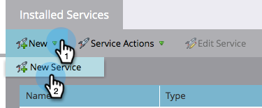
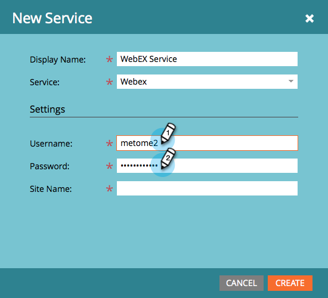
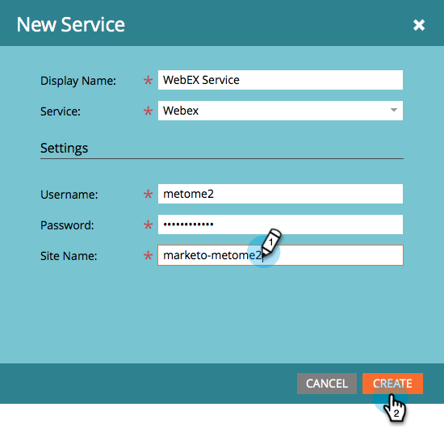
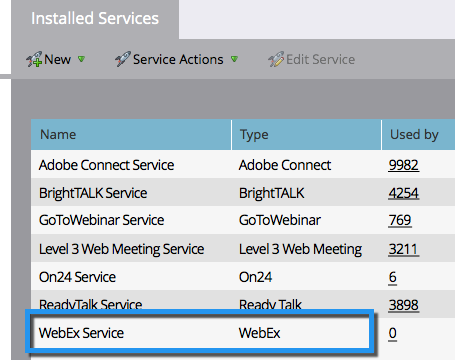

# Add [!DNL Webex] as a [!DNL LaunchPoint] Service {#add-webex-as-a-launchpoint-service}

Marketo Engage manages your [!DNL Webex] webinar registration and attendance.

>[!NOTE]
>
>**Admin Permissions Required**

>[!NOTE]
>
>An existing subscription to [!DNL Webex] and administration rights are necessary for this step. Have the following settings at hand: Username, Password, and Site Name.

>[!NOTE]
>
>The site name can be found at the end of the URL used to log into [!DNL Webex]. For example:
>
>`https://mycompany.webex.com/mw0300lc/mywebex/default.do?siteurl=mycompany`
>
>**Caution:** Do not enter the entire URL in this field; enter the site name only!

1. Go to the **[!UICONTROL Admin]** area. 

   

1. Click **[!UICONTROL LaunchPoint]**.

   

1. Select **[!UICONTROL New]** and then **[!UICONTROL New Service]**.

   

1. Enter a **[!UICONTROL Display Name]**. Under **[!UICONTROL Service]**, select **[!UICONTROL Webex]**.

   

1. Enter your **[!UICONTROL Username]** and **[!UICONTROL Password]**.

   

1. Complete the process by entering your **[!UICONTROL Site Name]** then click **[!UICONTROL Create]**.

   

Your **[!DNL Webex]** is now synced with Marketo.

   

>[!MORELIKETHIS]
>
>Learn how to [create an event with [!DNL Webex]](/help/marketo/product-docs/demand-generation/events/create-an-event/create-an-event-with-webex.md){target="_blank"}.
