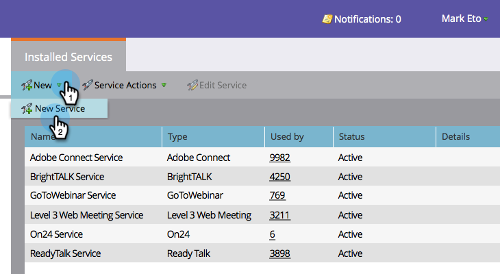
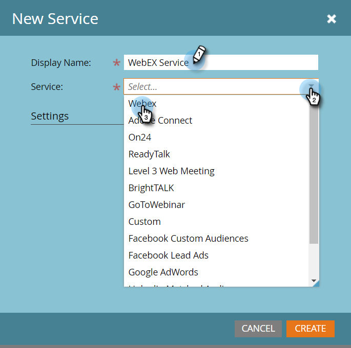

# Add WebEx as a LaunchPoint Service {#add-webex-as-a-launchpoint-service}

Marketo manages&nbsp;your WebEx webinar registration and attendance.

>[!NOTE]
>
>**Admin Permissions Required**

>[!NOTE]
>
>**Reminder**
>
>An existing subscription to WebEx and administration rights are necessary for this step. Have the following settings at hand: Username, Password, and Site Name.

>[!NOTE]
>
>The site name can be found at the end of the URL used to log into WebEx. For example:
>
>`https://mycompany.webex.com/mw0300lc/mywebex/default.do?siteurl=**mycompa**`**ny**
>
>Caution: Do not enter the entire URL in this field; enter the site name only!

1. Go to&nbsp;**Admin** and click&nbsp;**LaunchPoint**.

   

1. Select&nbsp;**New**&nbsp;and then&nbsp;**New Service**.

   

1. Enter a&nbsp;**Display Name**.&nbsp;Under&nbsp;**Service**, select **WebEx**.

   

1. Enter your&nbsp;**Username**&nbsp;and&nbsp;**Password**.

   

1. Complete the process by entering your** Site Name**&nbsp;then click&nbsp;**Create**.

     

1. Phenomenal! Your **WebEx** is now synced with Marketo.&nbsp;

   

>[!NOTE]
>
>**Related Articles**
>
>Learn how to [create an event with WebEx](../../../product-docs/demand-generation/events/create-an-event/create-an-event-with-webex.md).

