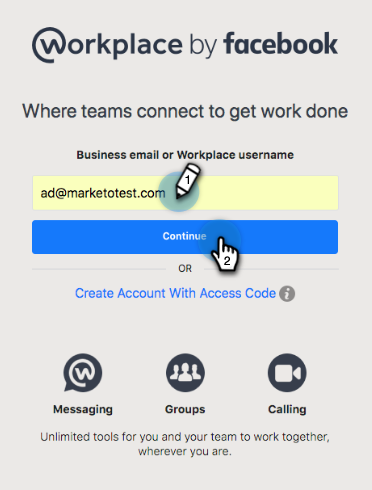
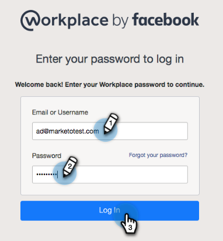
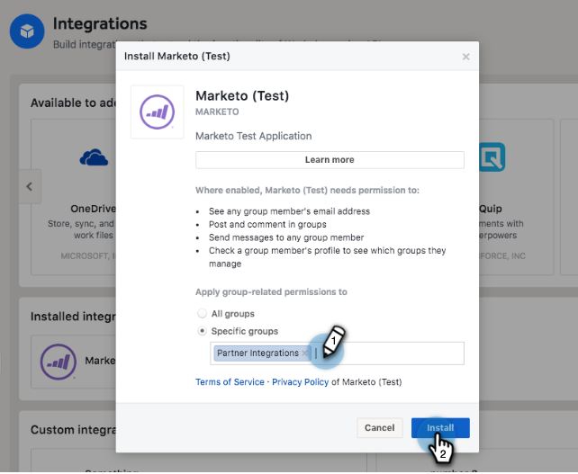
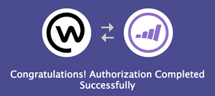
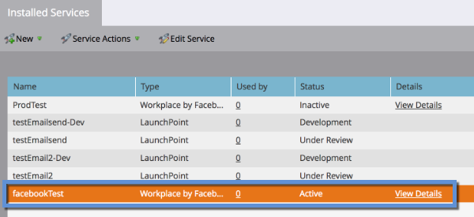
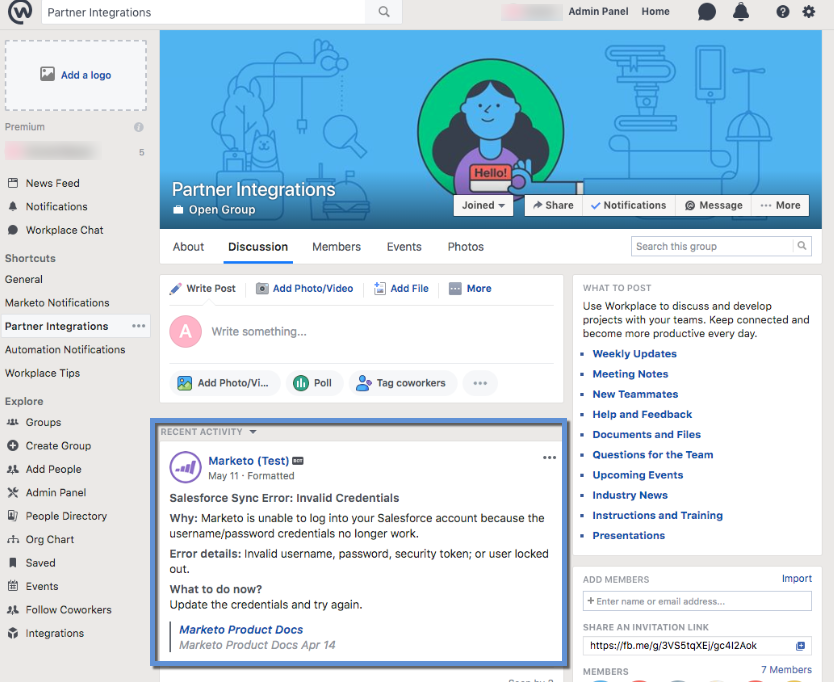

# Add [!DNL Workplace By Facebook] as a [!DNL LaunchPoint] Service {#add-workplace-by-facebook-as-a-launchpoint-service}

There are two notification types included in the [!DNL Workplace] integration:

* **System notifications**: Get [!DNL Workplace] notifications regarding important events in your Marketo instance, like alerts about current campaign statuses and any issues that require immediate attention (CRM errors and API limits).
* **Interesting moments**: When a [!DNL Marketo Insight] has been triggered by a known individual from a sales account, lead owners can be notified via [!DNL Workplace]. Notifications include lead information as well as details about the sales account.

>[!NOTE]
>
>**Admin Permissions Required**

>[!PREREQUISITES]
>
>If you don't have [!DNL Workplace] Notifications already enabled, please contact [Marketo Support](https://nation.marketo.com/t5/Support/ct-p/Support){target="_blank"}.

1. Go to the **[!UICONTROL Admin]** area.

   

1. Click **[!UICONTROL LaunchPoint]**.

   

1. Select **[!UICONTROL New]** and then **[!UICONTROL New Service]**.

   

1. Enter a **[!UICONTROL Display Name]** for your [!DNL Workplace] integration. In the **[!UICONTROL Service]** drop-down, select **[!UICONTROL Workplace by Facebook]**. Click **[!UICONTROL Create]**.

   

1. To receive system notifications and interesting moments, leave the options as-is. Click **[!UICONTROL Create]**.

   

1. Click **[!UICONTROL Authorize]**. This opens [!DNL Workplace] in a new tab, where you will complete the authorization and grant Marketo permission to pull information from [!DNL Workplace].

   

1. In the new [!DNL Workplace] tab, enter your business email or [!DNL Workplace] username and click **[!UICONTROL Continue]**.

   

1. Enter your [!DNL Workplace] credentials and click **[!UICONTROL Log in]**.

   

1. In the [!DNL Workplace] pop-up, choose a [!DNL Facebook] group where you want notifications from Marketo to be posted (e.g., [!UICONTROL Partner Integrations]). Click **[!UICONTROL Install]**.

   

1. You should see the confirmation notification below. The tab closes automatically.

   

1. Refresh the Marketo tab and confirm that [!DNL Workplace] is now listed as an active service in [!DNL LaunchPoint].

   

   Notifications will now begin posting to the [!DNL Facebook] group you selected in step 7. They'll look something like this:

   
