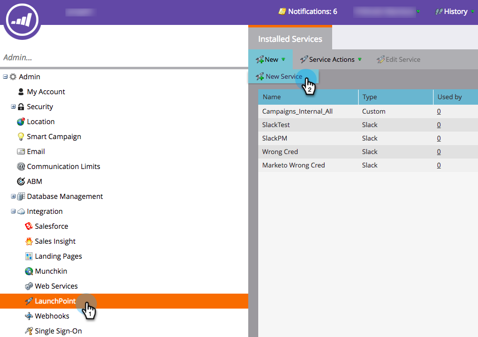
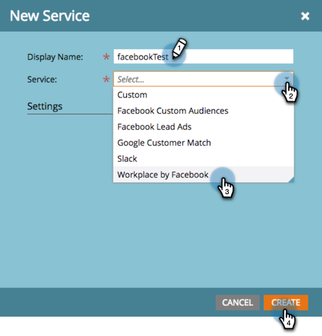
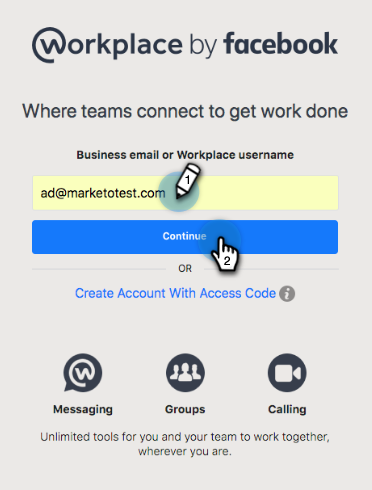
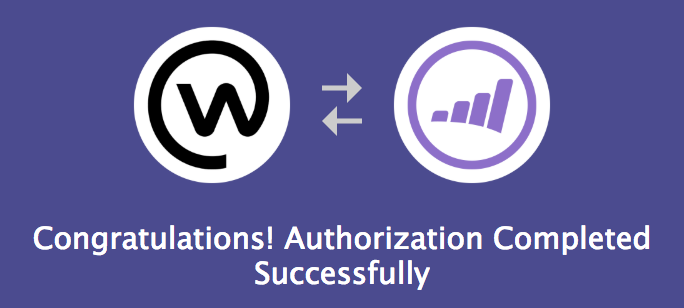
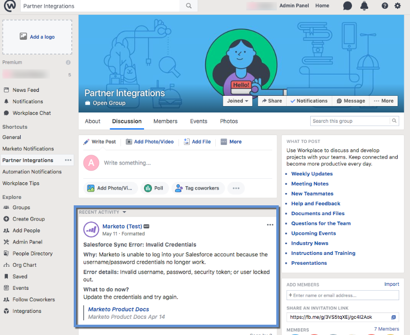

# Add Workplace By Facebook as a LaunchPoint Service {#add-workplace-by-facebook-as-a-launchpoint-service}

There are two notification types included in the Workplace integration:

* **System notifications**: Get Workplace notifications regarding important events in your Marketo instance, like alerts about current campaign statuses and any issues that require immediate attention (CRM errors and API limits).
* **Interesting moments**: When a Marketo Insight has been triggered by a known individual from a sales account, lead owners can be notified via Workplace. Notifications include lead information as well as details about the sales account.

>[!NOTE]
>
>**Admin Permissions Required**

>[!NOTE]
>
>**Prerequisites**
>
>If you don't have Workplace Notifications already enabled, please [contact Support](http://docs.marketo.com/cdn-cgi/l/email-protection#9cefe9ececf3eee8dcf1fdeef7f9e8f3b2fff3f1).

1. Go to **LaunchPoint**, then under **New** click **New Service**.

   

1. Enter a display name for your Workplace integration. In the **Service** drop-down, select **Workplace by Facebook**. Click **Create**.

   

1. To receive system notifications and interesting moments, leave the options as is. Click **Create**.

   

1. Click **Authorize**. This opens Workplace in a new tab, where you will complete the authorization and grant Marketo permission to pull information from Workplace.

   

1. In the new Workplace tab, enter your business email or Workplace username and click **Continue**.

   

1. Enter your Workplace credentials and click **Log in**.

   

1. In the Workplace pop-up, choose a Facebook group where you want notifications from Marketo to be posted (e.g., Partner Integrations). Click **Install**.

   

1. You should see the confirmation notification below. The tab closes automatically.

   

1. Refresh the Marketo tab and confirm that Workplace is now listed as an active service in LaunchPoint.

   

   Notifications will now begin posting to the Facebook group you selected in step 7. They'll look something like this:

   

