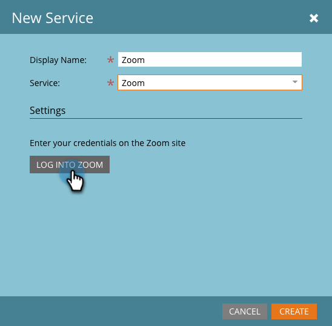
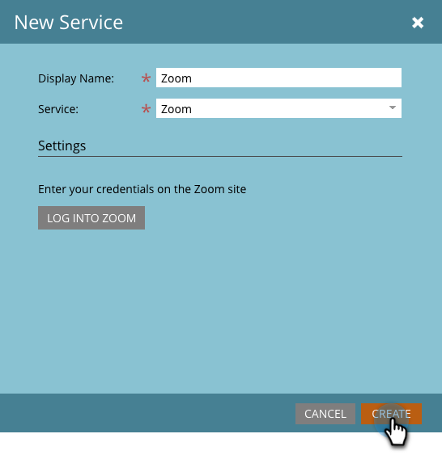

# Add Zoom as a LaunchPoint Service {#add-zoom-as-a-launchpoint-service}

Marketo manages your Zoom registration and attendance.

>[!NOTE]
>
>**Admin Permissions Required**

>[!NOTE]
>
>An existing subscription to Zoom and administration rights are necessary for this step. Have the email and password you use to sign in to Zoom on hand.

1. Go to the **Admin** area and click **LaunchPoint**.

   

1. Click the **New** drop-down and select **New Service**.

   

1. Enter a **Display Name**. Under **Service**, select **Zoom**.

   

1. Click **Log Into Zoom**.

   

1. In the Zoom login window, enter your Zoom credentials and click **Sign in**.

   

1. After the window closes, click **Create**.

   

   Great! Your Zoom account is now synced with Marketo and can be found in the LaunchPoint area.

>[!CAUTION]
>
>When you update your password in Zoom, you must update your password in Marketo as well.

>[!MORELIKETHIS]
>
>Learn how to [create an event with Zoom](/help/marketo/product-docs/demand-generation/events/create-an-event/create-an-event-with-zoom.md).
