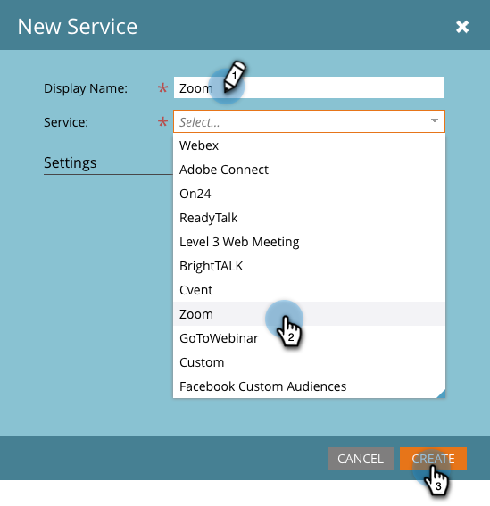

# Add [!DNL Zoom] as a [!DNL LaunchPoint] Service {#add-zoom-as-a-launchpoint-service}

Marketo manages your [!DNL Zoom] registration and attendance.

>[!NOTE]
>
>**Admin Permissions Required**

>[!NOTE]
>
>An existing subscription to [!DNL Zoom] and administration rights are necessary for this step. Have the email and password you use to sign in to [!DNL Zoom] on hand.

1. Go to the **[!UICONTROL Admin]** area.

   

1. Click **[!UICONTROL LaunchPoint]**.

   

1. Select **[!UICONTROL New]** and then **[!UICONTROL New Service]**.

   

1. Enter a **[!UICONTROL Display Name]**. Under **[!UICONTROL Service]**, select **[!UICONTROL Zoom]**.

   

1. Click **[!UICONTROL Log Into Zoom]**.

   

1. In the [!DNL Zoom] login window, enter your [!DNL Zoom] credentials and click **[!UICONTROL Sign in]**.

   

1. After the window closes, click **[!UICONTROL Create]**.

   

Your [!DNL Zoom] account is now synced with Marketo and can be found in the [!UICONTROL LaunchPoint] area.

>[!CAUTION]
>
>When you update your password in Zoom, you must update your password in Marketo as well.

>[!MORELIKETHIS]
>
>Learn how to [create an event with [!DNL Zoom]](/help/marketo/product-docs/demand-generation/events/create-an-event/create-an-event-with-zoom.md).
