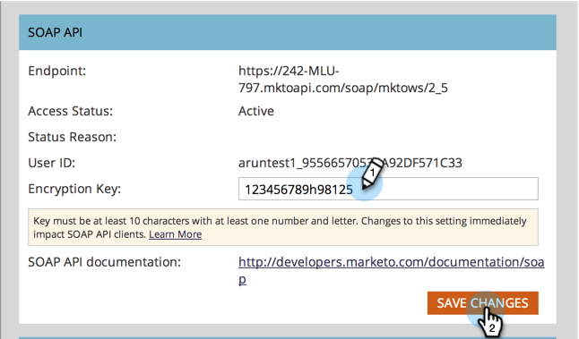

# Configuring Your SOAP API Settings {#configuring-your-soap-api-settings}

>[!NOTE]
>
>We suggest using the REST API. Learn more on [developers.marketo.com](https://developers.marketo.com/documentation/rest/).

>[!NOTE]
>
>**Admin Permissions Required**

1. Go to **Admin** and click **Web Services**.

   

1. Set an appropriate **Encryption Key**, click **Save Changes**, and pass all the information to your Developer.

   

>[!CAUTION]
>
>Your SOAP endpoint and User ID will be unique; do not send the screenshot in this article to your Developer.

>[!MORELIKETHIS]
>
>[SOAP API Documentation](https://developers.marketo.com/documentation/soap/)
