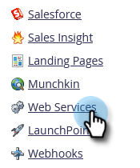

# Configuring Your SOAP API Settings {#configuring-your-soap-api-settings}

>[!NOTE]
>
>We suggest using the REST API. Learn more on [developers.marketo.com](https://developers.marketo.com/documentation/rest/).

>[!NOTE]
>
>**Admin Permissions Required**

1. Go to the **[!UICONTROL Admin]** area.

   

1. Click **[!UICONTROL Web Services]**.

   

1. Set an appropriate **[!UICONTROL Encryption Key]**, click **[!UICONTROL Save Changes]**, and pass all the information to your Developer.

   

>[!CAUTION]
>
>Your SOAP endpoint and [!UICONTROL User ID] will be unique; do not send the screenshot in this article to your Developer.

>[!MORELIKETHIS]
>
>[SOAP API Documentation](https://developers.marketo.com/documentation/soap/)
