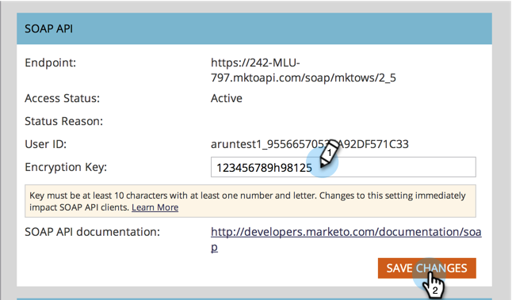

# Configuring Your SOAP API Settings {#configuring-your-soap-api-settings}

>[!IMPORTANT]
>
>The SOAP API is [being deprecacted](https://experienceleague.adobe.com/en/docs/marketo-developer/marketo/soap/soap-api) on July 31, 2026. It is recommended to use the [REST API](https://developer.adobe.com/marketo-apis/) instead.

>[!NOTE]
>
>**Admin Permissions Required**

1. Go to the **[!UICONTROL Admin]** area.

   

1. Click **[!UICONTROL Web Services]**.

   

1. Set an appropriate **[!UICONTROL Encryption Key]**, click **[!UICONTROL Save Changes]**, and pass all the information to your Developer.

   

>[!CAUTION]
>
>Your SOAP endpoint and [!UICONTROL User ID] are unique; do not send the screenshot in this article to your Developer.
