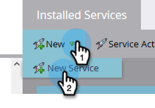
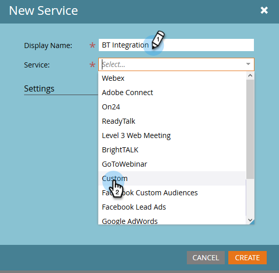
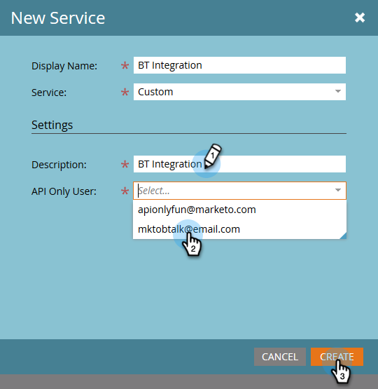
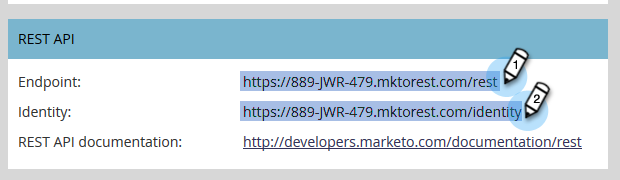

# Connect [!DNL BrightTALK] to Marketo {#connect-brighttalk-to-marketo}

Learn how to connect your [!DNL BrightTALK] channel to your Marketo instance. In order to do this, you must be an Admin for both.

>[!NOTE]
>
>**Admin Permissions Required**

## Steps in [!DNL BrightTALK] {#steps-in-brighttalk}

1. Log in to [business.brighttalk.com/demandcentral](https://business.brighttalk.com/demandcentral/login){target="_blank"} and click **[!UICONTROL Connect Now]**.
1. Under [!UICONTROL Advanced Marketo Connector], click **[!UICONTROL Connect]**.
1. You will come to the credentials screen, asking for: Client ID, Client Secret, Identity Service URL, and Rest Service URL. To get this information, log-in to Marketo.

## Steps in Marketo {#steps-in-marketo}

   >[!NOTE]
   >
   >At this point you'll be required to set up an [!DNL API Only User Role] and [!DNL API User] in order to restrict what permissions [!DNL BrightTALK] will have in your Marketo instance. Because we already have articles for those steps, we'll link you to them.

1. Create an [API Only User Role](/help/marketo/product-docs/administration/users-and-roles/create-an-api-only-user-role.md){target="_blank"}.

1. [Create an API User](/help/marketo/product-docs/administration/users-and-roles/create-an-api-only-user.md){target="_blank"}, using the [!DNL BrightTALK] API Role you created during Step 4.

1. Go back to the **[!UICONTROL Admin]** area.

   

1. Under **[!UICONTROL Integration]**, click **[!UICONTROL LaunchPoint]**.

   

1. Click the **[!UICONTROL New]** drop-down and select **[!UICONTROL New Service]**.

   

1. Enter a **[!UICONTROL Display Name]** of your choice. Click the **[!UICONTROL Service]** drop-down and select **[!UICONTROL Custom]** (do _not_ select [!DNL BrightTALK]).

   

   >[!CAUTION]
   >
   >Remember to not select [!DNL BrightTALK] in the drop-down. It is a field we are in the process of removing, and selecting it could create significant issues with your [!DNL Marketo/BrightTALK] integration.

1. Enter a [!UICONTROL Description] of your choice. Click the **[!UICONTROL API Only User]** drop-down and select the [!DNL BrightTALK API User] you created during Step 5. Click **[!UICONTROL Create]**.

   

1. Click **[!UICONTROL View Details]** for the custom service you just created.

   

1. Copy (and save) the **[!UICONTROL Client ID]** and **[!UICONTROL Client Secret]**. Click **[!UICONTROL Close]**.

   

1. Under **[!UICONTROL Integration]**, select **[!UICONTROL Web Services]**.

   

1. Under **[!UICONTROL Rest API]**, copy (and save) the **[!UICONTROL Endpoint]** and **[!UICONTROL Identity]**.

   

## Additional Steps in [!DNL BrightTALK] {#additional-steps-in-brighttalk}

1. Return to the [!DNL BrightTALK] connector set-up screen from Step 3, and enter the credentials you saved from Steps 12 and 14.

After the credentials are authenticated, you've officially connected [!DNL BrightTALK] to Marketo. The next step is to determine [which data fields you'd like to sync](https://support.brighttalk.com/hc/en-us/articles/115005131274-BrightTALK-Connector-for-Marketo-Choose-the-Fields-to-Sync){target="_blank"}.
