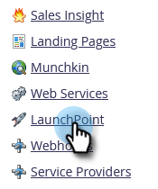
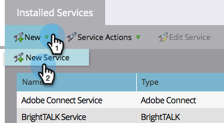
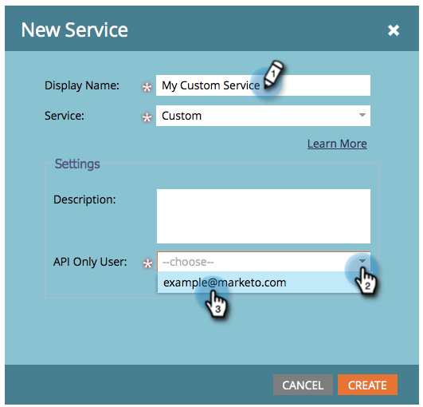

# Create a Custom Service for Use with ReST API {#create-a-custom-service-for-use-with-rest-api}

If you want to integrate with Marketo via the ReST API, you'll want to create a custom service. Here's how.

>[!PREREQUISITES]
>
>* [Create an API Only User Role](/help/marketo/product-docs/administration/users-and-roles/create-an-api-only-user-role.md)
>* [Create an API Only User](/help/marketo/product-docs/administration/users-and-roles/create-an-api-only-user.md)
>

>[!NOTE]
>
>**Admin Permissions Required**

>[!TIP]
>
>Check out our developers documentation for details on the [ReST API](https://developers.marketo.com/documentation/rest/). We also have the [SOAP API](https://developers.marketo.com/documentation/soap/) if that's what you need.

## Create Custom Service {#create-custom-service}

1. Go to the **[!UICONTROL Admin]** area.

   

1. Click **[!UICONTROL LaunchPoint]**.

   

1. Select **[!UICONTROL New]** and then **[!UICONTROL New Service]**.

   

1. Enter a **[!UICONTROL Display Name]** for the service. Select the **[!UICONTROL API Only User]** [previously created](/help/marketo/product-docs/administration/users-and-roles/create-an-api-only-user.md).

   

   >[!NOTE]
   >
   >Notice that we already have native integration for popular webinar services.

1. Click **[!UICONTROL Create]**.

   

   Oh yeah! The service is now created, let's go ahead and get all the credentials to provide for access.

## Credentials for API Access {#credentials-for-api-access}

1. Go to the **[!UICONTROL Admin]** area.

   

1. Click **[!UICONTROL LaunchPoint]**.

   

1. Click **[!UICONTROL View Details]** for the custom [!UICONTROL LaunchPoint] service created above.

   

1. Click **[!UICONTROL Get Token]**.

   

1. Provide the **[!UICONTROL Client Id]**, **[!UICONTROL Client Secret]**, **[!UICONTROL Authorized User]**, and **[!UICONTROL Token]** to the person in charge of establishing the connection.

   

>[!CAUTION]
>
>Don't share this information; it's the backdoor to your data. Keep it safe!
