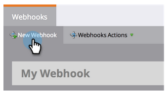

# Create a Webhook {#create-a-webhook}

>[!NOTE]
>
>**FYI**
>
>Marketo is now standardizing language across all subscriptions, so you may see lead/leads in your subscription and person/people in docs.marketo.com. These terms mean the same thing; it does not affect article instructions. There are some other changes, too. [Learn more](http://docs.marketo.com/display/DOCS/Updates+to+Marketo+Terminology).

Use webhooks to take advantage of third-party web services to send text messages, expand person data, and more.

>[!NOTE]
>
>**Availability**
>
>Not all customers have purchased this functionality. Contact your sales rep for details.

1. Go to **Admin **and click **Webhooks**.

   

1. Click **New Webhook**.

   

1. Name and configure your webhook.

   

   >[!NOTE]
   >
   >This often includes entering your third-party service credentials as a URL parameter, or in the POST template.

    * **URL**: Enter the URL you use to POST your request to the web service. To insert a token, such as the person's email address (**{{lead.Email Address}}**), in your request, click **Insert Token**.
    
    * **Template**: If you wish to transmit information in the body of the POST, enter the template. Use any data format that supports HTTP POST, including XML, JSON, or SOAP. To insert a token in your template, click **Insert Token**.
    
    * **Request Token Encoding**: If the token values include special characters (such as an ampersand, '&'), indicate the format of your request (**JSON** or **Form/Url**).
    
    * **Response type**: Select the format of the response you receive from the service (**JSON** or **XML**).

   Click Create.

   

>[!NOTE]
>
>**Deep Dive**
>
>Learn more in the [webhooks](http://developers.marketo.com/documentation/webhooks/) deep dive.

